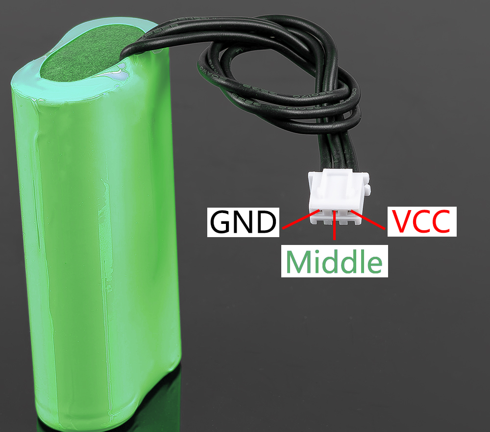

18650 Battery
=================

.. raw:: html

    

* **VCC**: Battery positive terminal, here there are two sets of VCC and GND is to increase the current and reduce the resistance.
* **Middle**: To balance the voltage between the two cells and thus protect the battery.
* **GND**: Negative battery terminal.

This is a custom battery pack made by SunFounder consisting of two 18650 batteries with a capacity of 2000mAh. The connector is XH2.54 3P, which can be charged directly after being inserted into the shield.

**Features**

* **Composition**: Li-ion
* **Battery Capacity**: 2000mAh, 14.8Wh
* **Battery Weight**: 90.8g
* **Number of Cells**: 2
* **Connector**: XH2.54 3pin
* **Over-discharge protection**: 6.0V