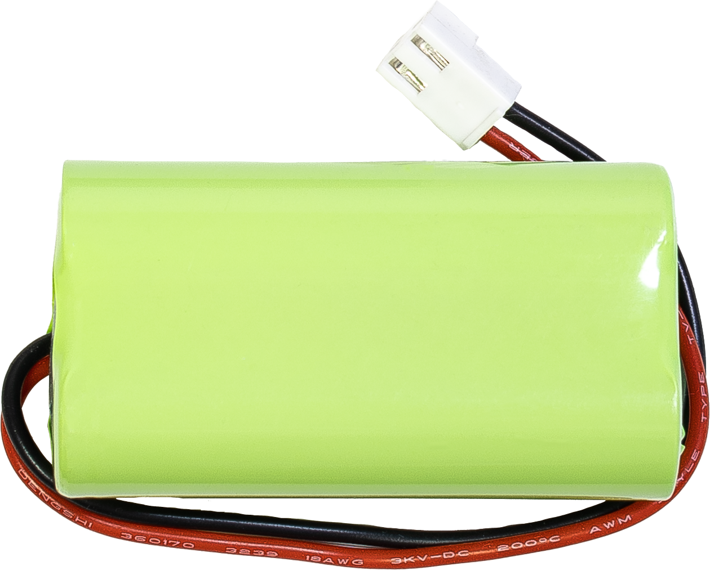

电池
=================

.. raw:: html

    

* **VCC**：电池正极。
* **GND**：电池负极。

这是 SunFounder 定制的电池组，由两节 18650 电池组成，容量为 2000mAh。连接器为 VH3.96 2P，插入扩展板后可直接充电。

**特点**

* **组成**：锂离子
* **电池容量**：2000mAh，14.8Wh
* **电池重量**：90.8g
* **电芯数量**：2
* **连接器**：VH3.96 2 针
* **过放保护**：6.0V
