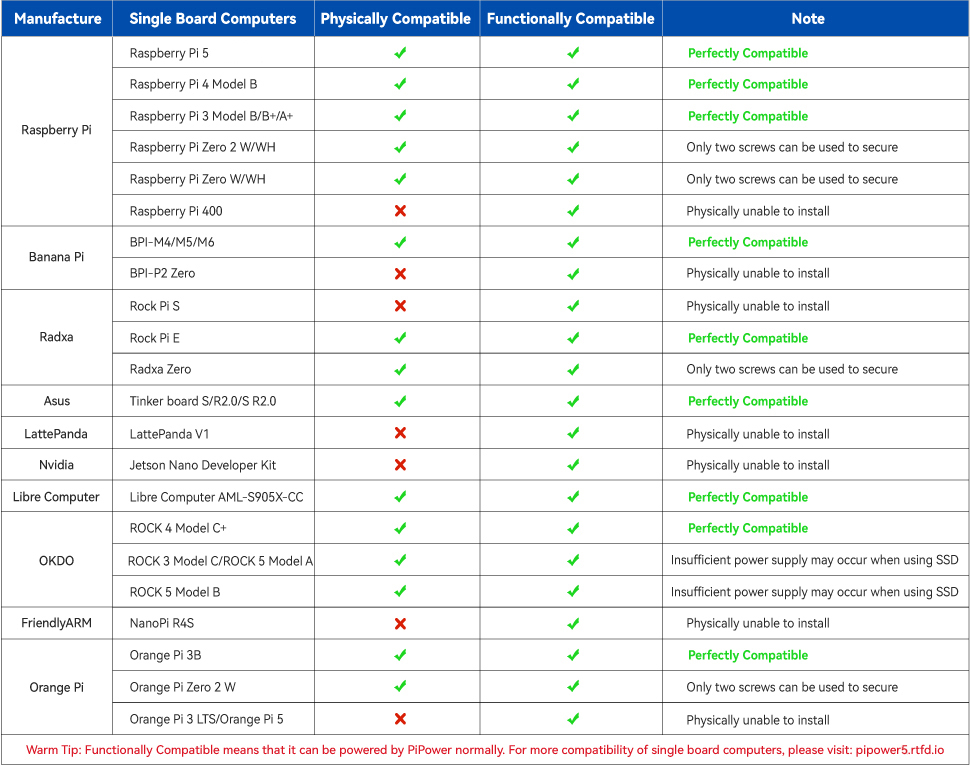

Compatible SBCs
=========================

PiPower 5 is compatible with various Single Board Computers (SBCs). It is fully compatible with the Raspberry Pi series in terms of structural installation, power supply, and software configuration.

Some SBCs can be powered by PiPower 5 but may not be structurally compatible or only partially compatible. For example, Zero-type boards can only be fixed using two mounting holes.

In terms of software configuration, we provide support for programming languages such as Python, MicroPython, and Arduino. You will need to choose the appropriate language based on your specific SBC.

