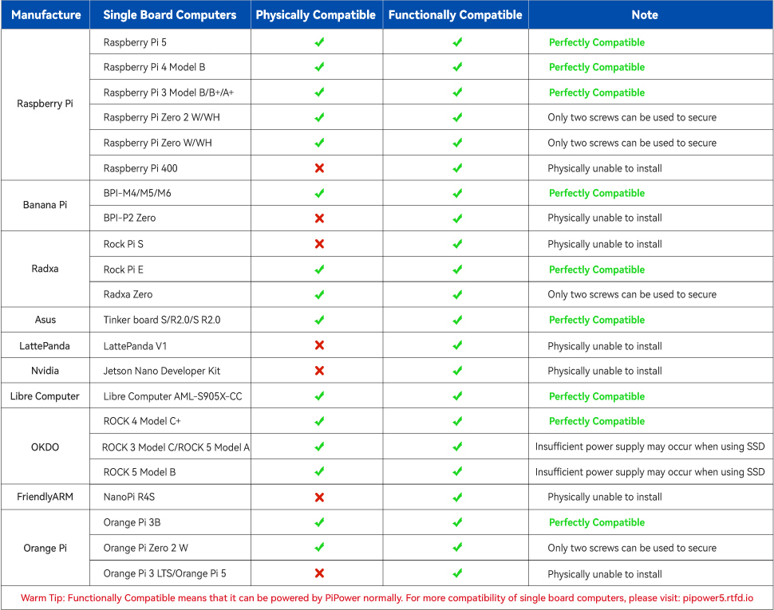

SBCs Compatibles
=========================

PiPower 5 es compatible con varios ordenadores de placa única (SBCs). Es totalmente compatible con la serie Raspberry Pi en términos de instalación estructural, suministro de energía y configuración de software.

Algunos SBCs pueden ser alimentados por PiPower 5 pero pueden no ser estructuralmente compatibles o solo parcialmente compatibles. Por ejemplo, las placas de tipo Zero solo se pueden fijar utilizando dos orificios de montaje.

.. En términos de configuración de software, ofrecemos soporte para lenguajes de programación como Python, MicroPython y Arduino. Deberá elegir el lenguaje apropiado según su SBC específico.

