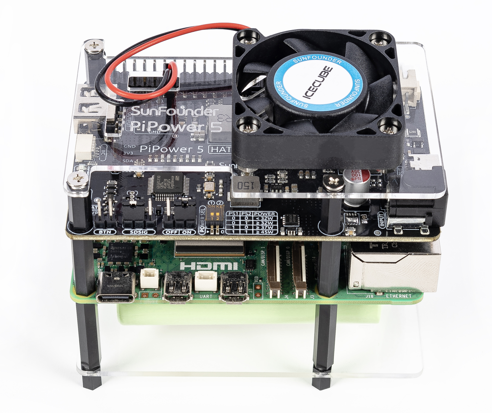

.. note::

    Hello, welcome to the SunFounder Raspberry Pi & Arduino & ESP32 Enthusiasts Community on Facebook! Dive deeper into Raspberry Pi, Arduino, and ESP32 with fellow enthusiasts.

    **Why Join?**

    - **Expert Support**: Solve post-sale issues and technical challenges with help from our community and team.
    - **Learn & Share**: Exchange tips and tutorials to enhance your skills.
    - **Exclusive Previews**: Get early access to new product announcements and sneak peeks.
    - **Special Discounts**: Enjoy exclusive discounts on our newest products.
    - **Festive Promotions and Giveaways**: Take part in giveaways and holiday promotions.

    👉 Ready to explore and create with us? Click [|link_sf_facebook|] and join today!

SunFounder |link_PiPower_5| - Protect Your Device & Data
================================================================================

* |link_PiPower_5_buy|

Thank you for choosing our |link_PiPower_5|.

.. .. note::
..     This document is available in the following languages.

..         * |link_german_tutorials|
..         * |link_jp_tutorials|
..         * |link_en_tutorials|
    
..     Please click on the respective links to access the document in your preferred language.

.. todo: new pic

PiPower 5 is a versatile UPS solution designed for seamless integration with Raspberry Pi devices. It features robust power path management, dual lithium battery charging and discharging capabilities, and essential protections against reverse polarity, overcharging, and over-discharging.

With an output of up to 5V/5A, PiPower 5 ensures stable performance for a wide range of devices. Its HAT+ configuration guarantees compatibility with Raspberry Pi 5, while additional outputs, including a USB-A port and a 4x2P header, provide support for various single-board computers (SBCs) and microcontroller platforms, such as Arduino, Pico, and ESP32.

An onboard microcontroller efficiently manages power operations and enables real-time monitoring of key parameters via I2C communication. These parameters include input voltage, output voltage, battery voltage, battery capacity, external power connection status, charging status, and the current power source (battery or USB).

Combining advanced battery management with broad compatibility, PiPower 5 is an essential tool for tech enthusiasts and professionals looking to optimize their hardware setups.

**Features**

* **Input**: 5-15V, 45W, USB Type-C PD, DC5.5-2.1
* **Output**: 5V/5A via Raspberry Pi GPIO, USB Type-A, and 2x4P 2.54mm pin headers
* **Charging Power**: Up to 20W
* **Battery Specs**: 7.4V 2 Cell 18650 Li-ion, XH2.54 3P connector
* **Configurable Settings via Jumpers**:

  * Default On Jumper: Configure whether the device powers on automatically when connected to power.
  * Shutdown Signal Jumper: Enable detection of the device's shutdown status.
  * External Power Button Pin Header: Connect an external power button for manual power control.

* **Onboard Indicators and Buttons**:
  
  * Battery status indicator
  * Input source indicator
  * Power button
  * Battery reverse connection indicator
  * Output power indicator

* **Onboard Microcontroller**: 32-bit ARM Cortex-M23, supporting I2C communication

* **I2C communication interfaces**: 
  
  * Raspberry Pi GPIO
  * SH1.0 4P (compatible with Qwiic and STEMMA QT)
  * 1x4P 2.54mm pin header

.. **Table of Contents**

.. toctree::
   :maxdepth: 2
   :hidden:
   :caption: Getting Started

   About PiPower 5 <self>
   assembly
   basic

.. toctree::
   :maxdepth: 2
   :hidden:
   :caption: Hardware Overview

   pipower_hat
   battery
   fan

.. toctree::
   :maxdepth: 2
   :hidden:
   :caption: Software Configuration

   pipower_software
   use_with_python
   use_with_micropython
   use_with_arduino

.. toctree::
   :maxdepth: 2
   :hidden:
   :caption: Appendix

   compatible_sbc
   Join Our Community <https://bit.ly/raphaelkit>

**Copyright Notice**

All contents including but not limited to texts, images, and code in this manual are owned by the SunFounder Company. You should only use it for personal study,investigation, enjoyment, or other non-commercial or nonprofit purposes, under therelated regulations and copyrights laws, without infringing the legal rights of the author and relevant right holders. For any individual or organization that uses these for commercial profit without permission, the Company reserves the right to take legal action.

