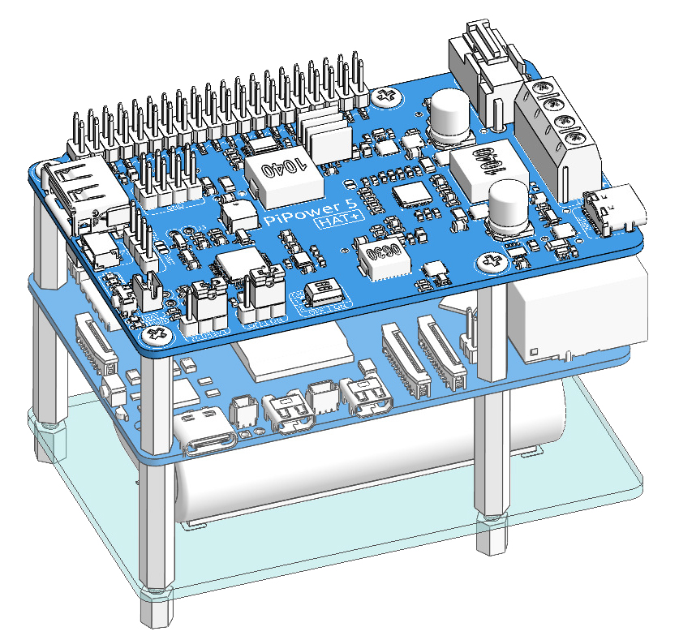

.. note::

    Bonjour, bienvenue dans la communauté SunFounder des passionnés de Raspberry Pi, Arduino et ESP32 sur Facebook ! Explorez plus en profondeur Raspberry Pi, Arduino et ESP32 avec d'autres passionnés.

    **Pourquoi nous rejoindre ?**

    - **Assistance d'experts** : Résolvez les problèmes post-achat et les défis techniques avec l'aide de notre communauté et de notre équipe.
    - **Apprendre et partager** : Échangez des astuces et des tutoriels pour améliorer vos compétences.
    - **Aperçus exclusifs** : Accédez en avant-première aux annonces de nouveaux produits et aux aperçus.
    - **Réductions spéciales** : Profitez de remises exclusives sur nos produits les plus récents.
    - **Promotions festives et cadeaux** : Participez à des concours et à des promotions saisonnières.

    👉 Prêt à explorer et à créer avec nous ? Cliquez [|link_sf_facebook|] et rejoignez-nous dès aujourd'hui !

SunFounder PiPower5 - Protégez votre appareil et vos données
================================================================================

.. * |link_PiPower_5_buy|

.. Thank you for choosing our |link_PiPower_5|.

Merci d'avoir choisi notre PiPower5.

.. .. note::
..     This document is available in the following languages.

..         * |link_german_tutorials|
..         * |link_jp_tutorials|
..         * |link_en_tutorials|

..     Please click on the respective links to access the document in your preferred language.

.. todo: new pic

Le PiPower 5 est une solution UPS polyvalente conçue pour une intégration transparente avec les appareils Raspberry Pi. Il dispose d'une gestion robuste du chemin d'alimentation, de capacités de charge et décharge de deux batteries au lithium, et de protections essentielles contre l'inversion de polarité, la surcharge et la décharge excessive.

Avec une sortie allant jusqu'à 5V/5A, le PiPower 5 assure des performances stables pour une large gamme d'appareils. Sa configuration HAT+ garantit la compatibilité avec le Raspberry Pi 5, tandis que les sorties supplémentaires, y compris un port USB-A et un connecteur 4x2P, offrent une prise en charge pour divers ordinateurs monocarte (SBC) et plateformes de microcontrôleurs, telles qu'Arduino, Pico et ESP32.

Un microcontrôleur intégré gère efficacement les opérations d'alimentation et permet la surveillance en temps réel des paramètres clés via la communication I2C. Ces paramètres incluent la tension d'entrée, la tension de sortie, la tension de la batterie, la capacité de la batterie, l'état de connexion de l'alimentation externe, l'état de charge et la source d'alimentation actuelle (batterie ou USB).

Alliant une gestion avancée de la batterie à une large compatibilité, le PiPower 5 est un outil essentiel pour les passionnés de technologie et les professionnels cherchant à optimiser leurs configurations matérielles.

**Caractéristiques**

* **Entrée** : 5-15V, 45W, USB Type-C PD, DC5.5-2.1
* **Sortie** : 5V/5A via GPIO Raspberry Pi, USB Type-A et connecteurs à broches 2x4P 2.54mm
* **Puissance de charge** : Jusqu'à 20W
* **Spécifications de la batterie** : 7.4V 2 cellules Li-ion, connecteur XH2.54 3P
* **Paramètres configurables via cavaliers** :

  * Cavalier Default On : Configure si l'appareil s'allume automatiquement lorsqu'il est connecté à l'alimentation.
  * Cavalier Shutdown Signal : Active la détection de l'état d'arrêt de l'appareil.
  * Connecteur pour bouton d'alimentation externe : Connectez un bouton d'alimentation externe pour un contrôle manuel de l'alimentation.

* **Indicateurs et boutons intégrés** :

  * Indicateur d'état de la batterie
  * Indicateur de source d'entrée
  * Bouton d'alimentation
  * Indicateur de connexion inversée de la batterie
  * Indicateur de puissance de sortie

* **Microcontrôleur intégré** : ARM Cortex-M23 32 bits, prenant en charge la communication I2C

* **Interfaces de communication I2C** :

  * GPIO Raspberry Pi
  * SH1.0 4P (compatible avec Qwiic et STEMMA QT)
  * Connecteur à broches 1x4P 2.54mm

.. **Table of Contents**

.. toctree::
   :maxdepth: 2
   :hidden:
   :caption: Pour commencer

   À propos du PiPower 5 <self>
   assembly
   quick_guide

.. toctree::
   :maxdepth: 2
   :hidden:
   :caption: Aperçu du matériel

   pipower_hat

.. toctree::
   :maxdepth: 2
   :hidden:
   :caption: Configuration logicielle

   pipower5_software
   update_firmware
   use_with_python

.. toctree::
   :maxdepth: 2
   :hidden:
   :caption: Annexe

   compatible_sbc
   troubleshooting
   faq

**Avis de droit d'auteur**

Tout le contenu, y compris mais sans s'y limiter, les textes, images et code de ce manuel sont la propriété de SunFounder Company. Vous ne devez l'utiliser qu'à des fins d'étude personnelle, de recherche, de loisir ou à d'autres fins non commerciales ou non lucratives, conformément aux réglementations et lois sur le droit d'auteur en vigueur, sans porter atteinte aux droits légaux de l'auteur et des ayants droit. Pour toute personne ou organisation utilisant ce contenu à des fins commerciales sans autorisation, la Société se réserve le droit d'intenter une action en justice.

