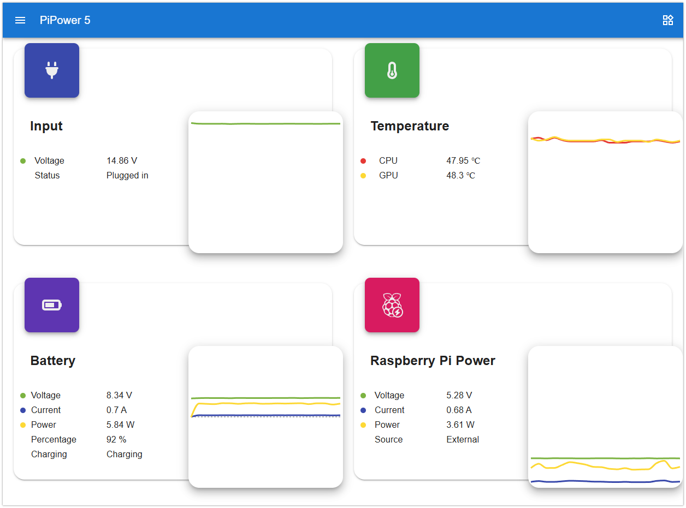
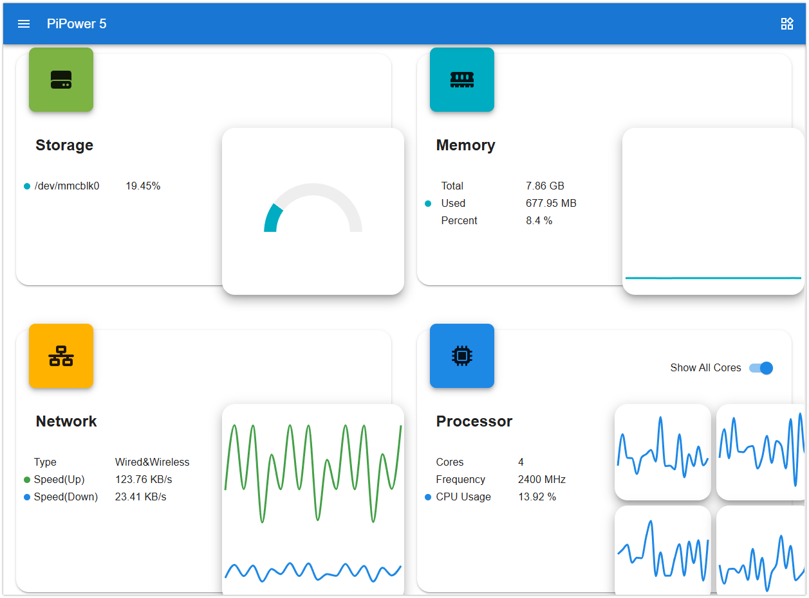
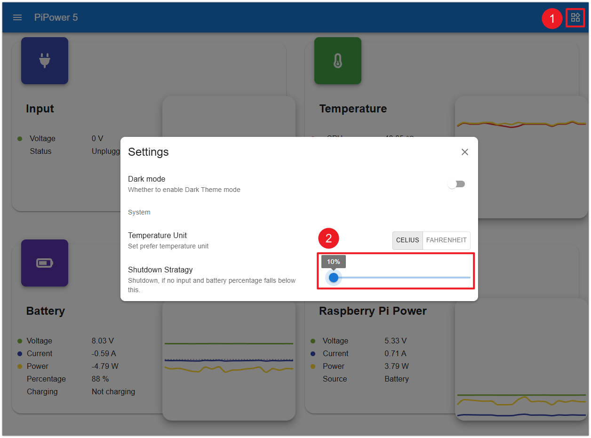

.. _pipower5_tool:

PiPower 5 ツール
===============================

PiPower 5 ツールは、PiPower 5 のコンパニオンソフトウェアです。

以下の機能を提供します:

- 安全なシャットダウンサポート
- バッテリーおよび充電管理
- 電力監視
- Web ダッシュボードへのアクセス
- イベント通知

PiPower 5 は以下の状況で Raspberry Pi にシャットダウン要求を送信できます:

- PiPower ボタンを 2 秒間長押ししたとき
- バッテリーレベルが設定されたシャットダウン残量を下回ったとき

Raspberry Pi のシャットダウン完了後、PiPower 5 は自動的に電源を切断し、SD カードの破損や予期しない電源喪失の問題を防ぐことができます。

.. start_install_pipower5

``pipower5`` ツールのインストール
----------------------------------------------------

PiPower 5 ツールをインストールします:

1. リポジトリをクローン:

   .. code-block:: shell

      git clone https://github.com/sunfounder/pipower5

2. ディレクトリに移動:

   .. code-block:: shell

      cd pipower5

3. インストーラーを実行:

   .. code-block:: shell

      sudo python3 install.py

4. プロンプトが表示されたら Raspberry Pi を再起動します。

.. end_install_pipower5

コマンドリファレンス
---------------------------------------

``pipower5`` ツールは PiPower 5 のステータス情報と設定オプションへのアクセスを提供します。

たとえば、以下のコマンドは現在の PiPower 5 ステータスを表示します:

.. code-block:: shell

   pipower5 -a

出力例:

.. code-block::

   Input:
      voltage: 0 mV
      current: 0 mA
      power: 0.000 W
      plugged in: False
   Output:
      voltage: 5296 mV
      current: 452 mA
      power: 2.394 W
   Battery:
      voltage: 8028 mV
      current: -315 mA
      power: -2.529 W
      percentage: 91 %
      source: 1 - Battery
      charging: False

   Internal:
      shutdown request: 0 - NONE
      power button: 0 - RELEASED
      max charging current: 0 mA
      default on: on
      shutdown percentage: 10 %

これらの設定はニーズに合わせてカスタマイズできます。

``pipower5`` または ``pipower5 -h`` で手順を表示します。

.. code-block:: text

  usage: pipower5 [-h] [-v] [-c] [-drd [DATABASE_RETENTION_DAYS]]
                  [-dl [{debug,info,warning,error,critical}]] [-rd]
                  [-cp [CONFIG_PATH]] [-sp [SHUTDOWN_PERCENTAGE]] [-iv] [-ic]
                  [-ov] [-oc] [-bv] [-bc] [-bp] [-bs] [-ii] [-ichg] [-do] [-sr]
                  [-pb] [-cc] [-a] [-fv] [-pfs [POWER_FAILURE_SIMULATION]]
                  [-seo [SEND_EMAIL_ON]] [-set [SEND_EMAIL_TO]]
                  [-ss [SMTP_SERVER]] [-smp [SMTP_PORT]] [-se [SMTP_EMAIL]]
                  [-spw [SMTP_PASSWORD]] [-ssc [SMTP_SECURITY]] [-bzo [BUZZ_ON]]
                  [-bzv [BUZZER_VOLUME]] [-bzt [BUZZER_TEST]] [-u [{C,F}]]
                  [{start,stop}]

  PiPower 5

  positional arguments:
    {start,stop}          Command

  options:
    -h, --help            show this help message and exit
    -v, --version         Show version
    -c, --config          Show config
    -drd [DATABASE_RETENTION_DAYS], --database-retention-days [DATABASE_RETENTION_DAYS]
                          Database retention days
    -dl [{debug,info,warning,error,critical}], --debug-level [{debug,info,warning,error,critical}]
                          Debug level
    -rd, --remove-dashboard
                          Remove dashboard
    -cp [CONFIG_PATH], --config-path [CONFIG_PATH]
                          Config path
    -sp [SHUTDOWN_PERCENTAGE], --shutdown-percentage [SHUTDOWN_PERCENTAGE]
                          Set shutdown percentage, leave empty to read
    -iv, --input-voltage  Read input voltage
    -ic, --input-current  Read input current
    -ov, --output-voltage
                          Read output voltage
    -oc, --output-current
                          Read output current
    -bv, --battery-voltage
                          Read battery voltage
    -bc, --battery-current
                          Read battery current
    -bp, --battery-percentage
                          Read battery percentage
    -bs, --battery-source
                          Read battery source
    -ii, --is-input-plugged_in
                          Read is input plugged in
    -ichg, --is-charging  Read is charging
    -do, --default-on     Read default on
    -sr, --shutdown-request
                          Read shutdown request
    -pb, --power-btn      Read power button
    -cc, --charging-current
                          Max charging current
    -a, --all             Show all status
    -fv, --firmware       PiPower5 firmware version
    -pfs [POWER_FAILURE_SIMULATION], --power-failure-simulation [POWER_FAILURE_SIMULATION]
                          Power failure simulation
    -seo [SEND_EMAIL_ON], --send-email-on [SEND_EMAIL_ON]
                          Send email on: ['battery_activated', 'low_battery',
                          'power_disconnected', 'power_restored',
                          'power_insufficient', 'battery_critical_shutdown',
                          'battery_voltage_critical_shutdown']
    -set [SEND_EMAIL_TO], --send-email-to [SEND_EMAIL_TO]
                          Email address to send email to
    -ss [SMTP_SERVER], --smtp-server [SMTP_SERVER]
                          SMTP server
    -smp [SMTP_PORT], --smtp-port [SMTP_PORT]
                          SMTP port
    -se [SMTP_EMAIL], --smtp-email [SMTP_EMAIL]
                          SMTP email
    -spw [SMTP_PASSWORD], --smtp-password [SMTP_PASSWORD]
                          SMTP password
    -ssc [SMTP_SECURITY], --smtp-security [SMTP_SECURITY]
                          SMTP security, 'none', 'ssl' or 'tls'
    -bzo [BUZZ_ON], --buzz-on [BUZZ_ON]
                          Buzz on: ['battery_activated', 'low_battery',
                          'power_disconnected', 'power_restored',
                          'power_insufficient', 'battery_critical_shutdown',
                          'battery_voltage_critical_shutdown']
    -bzv [BUZZER_VOLUME], --buzzer-volume [BUZZER_VOLUME]
                          Buzz volume
    -bzt [BUZZER_TEST], --buzzer-test [BUZZER_TEST]
                          Test buzzer on selected event.
    -u [{C,F}], --temperature-unit [{C,F}]
                          Temperature unit

.. note::

   ``pipower5.service`` の状態を変更するたびに、以下のコマンドを使用して設定変更を反映させる必要があります。

   .. code-block:: shell

      sudo systemctl restart pipower5.service

   systemctl ツールを使用して pipower5 プログラムの状態を確認します。

   .. code-block:: shell

      sudo systemctl status pipower5.service

   または、プログラムが生成したログファイルを確認します。

   .. code-block:: shell

      cat /opt/pipower5/log

Web ダッシュボード
----------------------------------------------------

PiPower 5 ツールには、監視と設定のための内蔵 Web ダッシュボードが含まれています。

ブラウザからダッシュボードにアクセスします:

.. code-block:: text

   http://<raspberry-pi-ip>:34001

ダッシュボードの機能:

- バッテリー残量の監視
- 充電状態の監視
- 入力・出力電圧の監視
- 電流の監視
- シャットダウン残量の設定
- 通知管理
- Raspberry Pi デバイス情報

ダッシュボードから直接シャットダウン残量を設定することもできます:

ダッシュボードが不要な場合は、以下のコマンドで削除します:

.. code-block:: shell

   pipower5 --remove-dashboard

安全なシャットダウン
----------------------------------------------------

PiPower 5 は Raspberry Pi システムの自動安全シャットダウン保護をサポートします。

シャットダウンのワークフロー:

.. code-block:: text

   シャットダウンがトリガーされる
   -> Raspberry Pi が安全なシャットダウンを実行
   -> PiPower 5 がシャットダウン完了を検出
   -> PiPower 5 が自動的に電源を切断

これにより以下を防止します:

- SD カードの破損
- ファイルシステムの損傷
- 予期しない電源喪失の問題

Raspberry Pi シャットダウン後の電源オフ
+++++++++++++++++++++++++++++++++++++++

.. start_power_off_after_shutdown

Raspberry Pi のシャットダウン後に PiPower 5 が自動的に電源を切断できるようにするには、追加の設定が必要です。

1. **Raspberry Pi 4 または 5** を使用している場合:

   * PiPower 5 の ``SDSIG`` ジャンパーが ``PI3V3`` に接続されていることを確認します。

     .. image:: img/safe_shutdown_3v3.png
        :width: 400

   * Raspberry Pi 設定を開きます:

     .. code-block:: shell

        sudo raspi-config

   * 以下に移動します:

     .. code-block:: text

        6 Advanced Options
        -> A11 Shutdown Behaviour
        -> B1 Full power off Switch off Pi ...

   * プロンプトが表示されたら Raspberry Pi を再起動します。

2. **Raspberry Pi 3** 以前を使用している場合:

   * PiPower 5 の ``SDSIG`` ジャンパーを ``GPIO26`` に設定します。

     .. image:: img/safe_shutdown_io26.png
        :width: 400

   * ``/boot/firmware/config.txt`` を開きます:

     .. code-block:: shell

        sudo nano /boot/firmware/config.txt

   * 以下の行を追加します:

     .. code-block:: shell

        dtoverlay=gpio-poweroff,gpio_pin=26,active_low=1
        gpio=26=op,dh

   * ``Ctrl+X`` を押し、``Y`` を押し、``Enter`` を押してファイルを保存して終了します。

   * Raspberry Pi を再起動します。

     .. code-block:: shell

        sudo reboot

設定後、PiPower 5 は自動的に Raspberry Pi のシャットダウンを検出し、安全に電源を切断できます。

サポートされている安全なシャットダウン方法:

- PiPower ボタンを 2 秒間長押し
- Raspberry Pi デスクトップメニューからシャットダウン
- ``sudo shutdown now`` の実行
- バッテリーレベルが設定されたシャットダウン残量を下回った場合の自動シャットダウン

.. end_power_off_after_shutdown

シャットダウン残量の設定
+++++++++++++++++++++++++++++++++++++++

自動シャットダウンをトリガーするバッテリー残量を設定できます。

例:

.. code-block:: shell

   pipower5 -sp 30

これでシャットダウン閾値が 30% に設定されます。

次に以下のコマンドで設定変更を反映させます。

.. code-block:: shell

   sudo systemctl restart pipower5.service

バッテリーレベルが 30% を下回ると、PiPower 5 は Raspberry Pi にシャットダウンを通知し、自動的に電源を切断します。

現在のシャットダウン残量を読み取ることもできます:

.. code-block:: shell

   pipower5 -sp

.. tip::

   高電力消費 (>3A) の Raspberry Pi 5 システムでは、シャットダウン残量を ``100%`` に設定することを推奨します。

   これにより、外部電源が切断されたときに Raspberry Pi がすぐにシャットダウンし、システムとストレージデバイスを保護できます。

電力監視
----------------------------------------------------

PiPower 5 は以下をリアルタイムで監視します:

- バッテリー残量
- 充電状態
- 入力電圧
- 出力電圧
- 入力電流
- 出力電流
- バッテリー電圧
- バッテリー電流

便利なコマンド:

バッテリー残量の表示:

.. code-block:: shell

   pipower5 -bp

充電状態の表示:

.. code-block:: shell

   pipower5 -ichg

入力電圧の表示:

.. code-block:: shell

   pipower5 -iv

すべてのステータス情報の表示:

.. code-block:: shell

   pipower5 -a

全コマンドリスト:

.. code-block:: shell

   pipower5 --help

通知
----------------------------------------------------

PiPower5 は以下を通じてイベント駆動型通知をサポートします:

- ブザーアラート
- メール通知

サポートされているイベント:

- ``battery_activated``
- ``low_battery``
- ``power_disconnected``
- ``power_restored``
- ``power_insufficient``
- ``battery_critical_shutdown``
- ``battery_voltage_critical_shutdown``

.. note::

   ``pipower5.service`` の状態を変更するたびに、以下のコマンドを使用して設定変更を反映させる必要があります。

   .. code-block:: shell

      sudo systemctl restart pipower5.service

イベントの説明
+++++++++++++++++++++++++++++++++++++++++++++++++

1. ``battery_activated``

   バッテリーが電力供給を開始したときにトリガーされます。これは通常、外部電源が切断されたか、十分な電力を供給できない場合に発生します。

   * **リセット条件**: 外部電源が切断された後、自動的にリセットされます。

2. ``low_battery``

   バッテリー充電レベルが**設定されたシャットダウン閾値**を下回ったときに有効になります。

   * **繰り返し**: バッテリーがこの閾値を下回ったままの場合、10分ごとにイベントがトリガーされます。
   * **リセット条件**: バッテリー充電量が**シャットダウン閾値 + 5%** を超えるとリセットされます。

3. ``power_disconnected``

   外部電源が切断されたときにトリガーされます。

   * **リセット条件**: 外部電源が復旧するとリセットされます。

4. ``power_restored``

   外部電源が復旧したときにトリガーされます。

   * **リセット条件**: 外部電源が再び切断されるとリセットされます。

5. ``power_insufficient``

   外部電源が不十分で、バッテリーが補助電力を供給する必要がある場合に発生します。

   * **推奨アクション**: 電源の定格出力を確認するか、設定された充電電力設定を確認してください。
   * **リセット条件**: 外部電源が切断されるとリセットされます。

6. ``battery_critical_shutdown``

   **バッテリー容量が極めて低い**\ ためにシステムがシャットダウンする直前にトリガーされます。

7. ``battery_voltage_critical_shutdown``

   **バッテリー電圧**\ が危険閾値を下回り、シャットダウンにつながる場合にトリガーされます。

   * **注意**: このイベントは通常の使用ではめったにトリガーされません。通常、``low_battery`` イベントが電圧がここまで低下する前にシャットダウンシーケンスを開始します。これは**フェイルセーフシャットダウンメカニズム**として機能します。

これらのイベントにより、PiPower5 はプロアクティブな警告 (低バッテリー、電力不足など) と重要な保護 (シャットダウントリガー) の両方を提供し、安定した動作とデータ保護を保証します。

ブザーアラート
+++++++++++++++++++++++++++++++++++++++++++++++++

PiPower5 は異なるシステムイベントに対するブザー通知をサポートします。

**Web ダッシュボード**\ または\ **コマンドラインツール**\ を通じてブザーアラートを設定できます。
設定されたイベントが発生すると、PiPower5 は対応するブザー音を再生します。

機能:

- イベントベースのブザー通知
- 調整可能なブザー音量 (1～10)
- イベント音のプレビュー
- カスタムサウンドエフェクトのサポート

上級ユーザーはカスタムブザーサウンドエフェクトを作成することもできます。

1. 設定ファイルを開きます:

   .. code-block:: shell

      /opt/pipower5/venv/lib/python3.11/site-packages/pipower5/config.json

2. ``pipower5_buzz_sequence`` セクションを見つけます。

3. 各サウンドエフェクトは以下の形式で定義されます:

   .. code-block:: text

      [action, duration]

   ここで:

   - ``action`` は以下が可能です:

     - ``"A4"``、``"D3"``、``"C#4"`` などの音符
     - 周波数値 (整数)
     - 無音を表す ``"pause"``

   - ``duration`` は再生時間 (ミリ秒)

メールアラート
+++++++++++++++++++++++++++++++++++++++++++++++++

PiPower5 は以下のような重要なシステムイベントに対するメール通知をサポートします:

- 低バッテリー
- 電源切断
- 電源復旧
- 重大なシャットダウンイベント

メール通知は **Web ダッシュボード**\ または\ **コマンドラインツール**\ を通じて設定できます。

メールアラートを使用するには SMTP サーバーが必要です。ほとんどのメールプロバイダーが SMTP サービスをサポートしています。

- Gmail の場合、**アプリパスワード**\ を作成するだけです
- その他のプロバイダーの場合、SMTP アクセスを有効にし、必要に応じて専用の SMTP パスワードを生成してください

設定前に以下の情報を準備してください:

- SMTP サーバーアドレス
  (例: ``smtp.gmail.com``)

- SMTP ポート
  (例: ``465`` または ``25``)

- 暗号化タイプ
  (``None`` / ``SSL`` / ``TLS``)

- SMTP アカウント
  (通常はメールアドレス)

- SMTP パスワード
  (アプリパスワードまたは SMTP パスワード)

SMTP 情報を入力した後、受信者メールアドレスを設定します。

.. note::

   PiPower5 は SMTP サーバーを使用してメールアカウントにログインし、通知を送信します。

   同じメールアドレスを送信者と受信者の両方に使用できます。

セットアップ後、テストコマンドを使用して SMTP 接続とメール配信を確認します。
