PiPower 5 HAT
======================

.. interface:

接口概览
-------------------

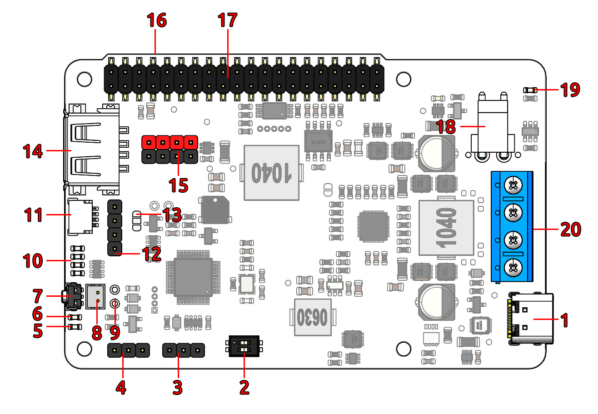

1. **USB Type-C 电源输入**

   - 外部电源输入，用于为 Raspberry Pi 供电并同时给电池充电。
   - 支持 **USB Power Delivery（PD）协议**，输入范围 **5V–15V**。

2. **电源输入选择器（DIP 开关）**

   - 允许选择不同的输入电源配置文件以实现灵活配置。

3. **默认 ON 跳线**

   - 定义系统在设备关机状态且连接外部电源时是否应自动开机。
   - ON = 自动开机启用，OFF = 需要手动启动。

4. **SDSIG（关机信号）**

   - 为 Raspberry Pi 提供关机检测。
   - 当桥接到 **PI3V3** 时，与 Raspberry Pi 4 和 Pi 5 配合使用。
   - 当短接到 **Pin 26** 时，支持 Pi 3 和 Pi Zero。
   - 正确配置后，PiPower5 将在 Raspberry Pi 关机后自动切断电源。

5. **PWR LED（输出状态指示灯）**

   - 系统输出激活时亮起。

6. **BAT LED（电池状态指示灯）**

   - 系统由电池供电时亮起。
   - 在没有外部电源运行时提醒监控电池消耗。

7. **电源按钮**

   - **按一次**：激活输出电源。
   - **长按（2 秒）**：通过 I²C 发送安全关机请求。
   - **长按（5 秒）**：强制立即断电（硬关机）。
   - **可自定义**：单击和双击操作可通过软件重新配置。

8. **外部电源按钮端子（ZH1.5 2P）**

   - 允许连接外部物理电源按钮。

9. **外部电源按钮排针（2.54mm）**

   - 用于外部电源按钮连接的替代可焊接排针选项。

10. **电池指示灯 LED**

    - 显示剩余电池容量和充电状态。
    - 注意：即使系统关闭，充电期间 LED 保持活动状态，直到电池充满。

11. **I²C 接口（SH1.0 4P）**

    - 兼容 **Qwiic** 和 **STEMMA QT** 生态系统。
    - 用于与板载微控制器和外部外设通信。

12. **I²C 接口（1x4P 2.54mm 排针）**

    - 替代 I²C 分支，带 **3V3 电源输出**，可配置为常开或受控。

13. **I²C 电源选择跳线**

    - **PERM**：连接外部电源时 3V3 电源始终开启。
    - **SHUT（默认）**：系统关机时 3V3 电源自动切断。

14. **USB Type-A 输出端口**

    - 提供**稳压 5V 输出**，适用于为外设或其他设备供电。
    - 为 Raspberry Pi 供电时，可能会遇到非 PD 电源警告，可以安全忽略。

15. **2x4P 2.54mm 电源输出排针**

    - 为外部模块或 SBC 提供额外的 5V 输出。

16. **Raspberry Pi GPIO 排针（母座连接器）**

    - Raspberry Pi 的直接接口，传输电源、I²C 和其他信号。
    - 完全兼容 Raspberry Pi 引脚排列。

17. **Raspberry Pi GPIO 排针（公针引出）**

    - 引出 Raspberry Pi GPIO 引脚，用于堆叠 HAT 或外部扩展。
    - **注意**：I²C 线路和 Pin 26 已被 PiPower5 功能占用。
    - 您也可以连接 GPIO 延长线（从侧板底部）在面包板上进行实验。

18. **电池连接器（XH2.54 3P）**

    - 电池连接接口。
    - 引脚顺序（从左到右）：负极、中点（两节电池之间）、正极。
    - 专为\ **7.4V（2 节）锂离子/锂聚合物电池**\ 设计。

19. **电池反接警告 LED**

    - 如果电池以反向极性连接，两个红色 LED 亮起，警告安装不正确。

20. **电池和输入电源螺丝端子**

    - 外部电池和电源的替代连接方法。
    - 支持\ **5V–15V 外部输入**\ （建议：>9V）。
    - 电池支持：\ **仅 2 x 3.7V 锂离子/锂聚合物电池**\ （不兼容 LiFePO₄ 电池）。

规格表
-----------------------------

.. list-table::
   :header-rows: 1
   :widths: 20 20 20 20 20

   * - 参数
     - 最小值
     - 典型值
     - 最大值
     - 单位
   * - 电池关断电流
     - \-
     - 60
     - \-
     - µA
   * - 电池静态电流
     - \-
     - 25
     - \-
     - mA
   * - DC-DC 输出电压
     - 5.1957
     - 5.2855
     - 5.3766
     - V
   * - DC-DC 过温保护
     - \-
     - 150
     - \-
     - ℃
   * - 电池充电功率
     - \-
     - \-
     - 20
     - W
   * - 充电过温保护
     - \-
     - 125
     - \-
     - ℃
   * - 均衡电阻
     - \-
     - 60
     - \-
     - Ω
   * - 均衡激活电压
     - \-
     - 4.2
     - \-
     - V

.. _power_input:

电源输入
-------------

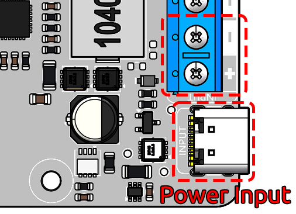

.. raw:: html

    

使用 Raspberry Pi 5 时，建议使用 USB PD 电源或最低输出 32W 的 DC 电源。否则，在高功耗期间，由于电源不足，电池可能无法正常充电，甚至耗尽电量。

您可以通过监控 **BAT LED** 指示灯来检查电池状态。当外部电源充足时，BAT LED 应保持熄灭，表示电池处于待机模式且未放电。如果 BAT LED 亮起，表示电池正在为设备供电，可能是因为外部电源不足或断开。BAT LED 长时间亮起可能导致电池过度放电，使其无法在停电期间充当不间断电源（UPS）。确保使用符合要求规格的电源以避免此类情况。

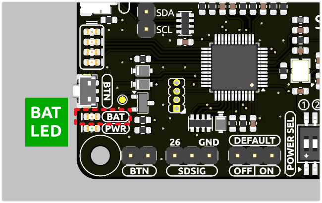

.. raw:: html

    

**电源路径**

PiPower 5 集成了电源路径管理，可以自动切换电源以减少电池损耗并确保不间断供电。主要功能包括：

- 当外部电源连接时，5V 输出通过降压电路从外部电源供电。输出可以通过开关关闭。如果条件允许，外部电源也可以同时为电池充电（详情请参见"充电电流"部分）。
- 当外部电源断开时，系统立即通过降压电路切换到电池供电。这种无缝过渡确保系统在电源中断期间继续正常工作。

您可以通过检查 BAT LED 指示灯来确认电池当前是否正在为系统供电。

**充电电流**

充电电流受两种限制的影响：

.. note::

   充电电流由"螺丝端子电源充电限制"和"充电功率选择限制"共同决定，并受两者中较小值的约束。

1. 螺丝端子电源充电限制

   通过螺丝端子电源输入供电时，充电电流会根据输入电压自动调整，如下所示：

   .. list-table::
      :header-rows: 1

      * - 输入电压（VBUS）
        - 最大充电电流
      * - 4.5 < VBUS ≤ 6.5V
        - 3A
      * - 6.5 < VBUS ≤ 9.5V
        - 2A
      * - 9.5 < VBUS ≤ 13.5V
        - 1.5A
      * - 13.5 < VBUS ≤ 16.5V
        - 2A

2. 充电功率选择限制

   板上的 2 位 DIP 开关允许选择不同的充电功率级别。每种设置对应的充电功率和输出功率分配如下：

   .. image:: img/power_selector.png
     :width: 50%
     :align: center

   .. list-table::
      :header-rows: 1

      * - 充电选择 1
        - 充电选择 2
        - 充电功率
      * - 0
        - 0
        - 5W
      * - 1
        - 0
        - 10W
      * - 0
        - 1
        - 15W
      * - 1
        - 1
        - 20W

**如何选择充电功率**

公式为：

*电源容量 = Raspberry Pi 所需功率 + 充电功率*

我们建议将 Raspberry Pi 的功率需求估计为 **20W 至 25W**。

- 如果使用 **30W 电源**，将充电功率设置为 **10W** 或 **5W**。
- 如果使用 **45W 电源**，可以安全地将充电功率设置为 **20W**。

如果您熟悉 Raspberry Pi 的功率需求，只要为偶尔的功率峰值预留足够的余量，可以设置更高的充电功率。

⚠️ 请谨慎：功率不足可能导致 Raspberry Pi 意外关机。

**充电过程**

- 当电池电压 ``VBAT <= 2.5V`` 时，系统以低电流（约 50 mA）进行涓流充电。
- 当 ``2.5V < VBAT <= VTRKL`` 时，继续涓流充电，电池充电电流增加到约 200 mA。
- 当 ``VTRKL < VBAT < VCV`` 时，系统切换到恒流充电，向电池提供预设的恒定电流。
- 一旦 ``VBAT = VCV``，且电池电压接近充满电水平时，充电电流逐渐减小，过渡到恒压充电。
- 在恒压充电期间，当充电电流降至 ``ISTOP`` 以下且电池电压接近恒压阈值时，充电停止，电池进入充满电状态。
- 在充满电状态下，系统持续监控电池电压。如果电压降至 ``VRCH`` 以下，充电自动恢复。

**保护功能**

PiPower 5 提供全面的保护功能，包括输入欠压和过压保护，以及充电芯片和 DC-DC 转换器的过热保护。这些功能确保系统稳定可靠运行。

**充电均衡**

板载充电均衡芯片在检测到单节电池电压超过 4.2V 时，激活 60Ω 电阻以低电流对电池放电。此功能有助于保持电池之间的电压平衡。

**温度保护**

当充电芯片内部温度超过 125°C 时，充电过程自动停止。同样，当 DC-DC 芯片内部温度超过 150°C 时，输出被禁用。

.. _power_button:

电源按钮
----------------

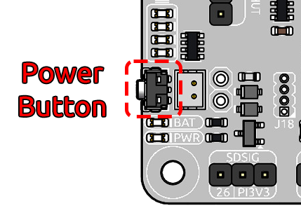

.. raw:: html

    

用于控制板子电源的板载电源按钮：

* **按一次**：激活输出。
* **按住 2 秒直到中间两个电池 LED 亮起，然后松开**：通过 I2C 发送关机请求。
* **按住超过 5 秒**：直接关闭输出。

.. _battery_indicators:

电池指示灯
--------------------------------

四个板载 LED 指示电池电量和充电状态。

.. note::

   如果设备在关机期间正在充电，指示灯将继续显示充电状态直到充电完成。

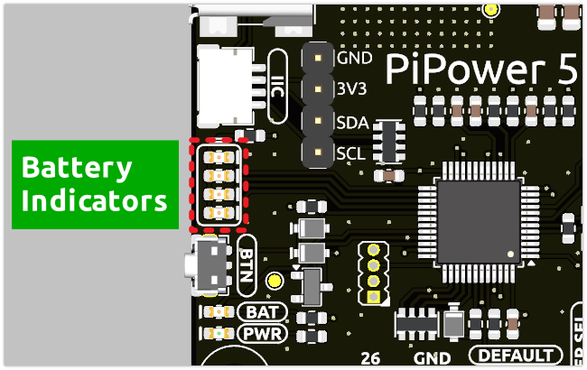

.. raw:: html

    

* **4 个 LED 亮**：电池 >80%
* **3 个 LED 亮**：60%< 电池 <80%
* **2 个 LED 亮**：40%< 电池 <60%
* **1 个 LED 亮**：20%< 电池 <40%
* **第一个 LED 闪烁**：电池 <20%
* **LED 循环顺序亮起**：正在充电
* **中间两个 LED 闪烁**：等待关机信号
* **所有 LED 灭**：未通电或处于休眠模式

.. _battery_connector:

电池连接器
------------------------
VH3.96 2P 电池连接器和螺丝端子电池连接器。

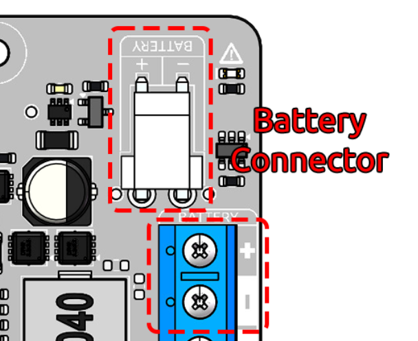

.. raw:: html

    

.. _cap_btn:

外部电源按钮端子和排针
--------------------------------------------

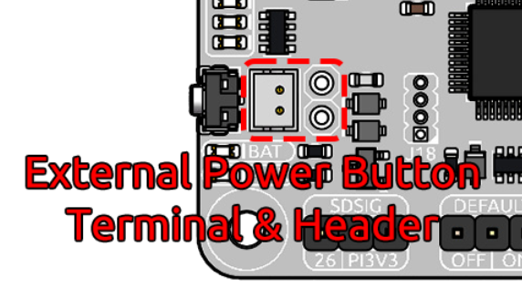

.. raw:: html

    

此端子或排针设计用于连接外部电源按钮。将瞬时开关（如轻触开关或复古风格金属按钮）连接到跳线引脚。按钮的两根导线可以以任意方向连接到跳线引脚，因为不需要极性。连接后，您可以像使用板载电源按钮一样使用外部按钮。

.. _cap_sdsig:

SDSIG 跳线
------------

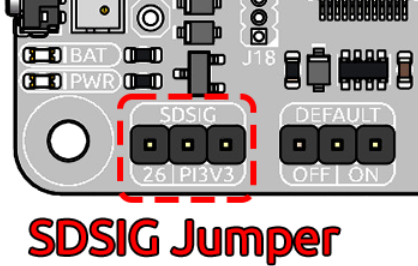

.. raw:: html

    

为 Raspberry Pi 提供关机检测。

* 当桥接到 PI3V3 时，与 Raspberry Pi 4 和 Pi 5 配合使用。
* 当短接到 Pin 26 时，支持 Pi 3 和 Pi Zero。

正确配置后，PiPower5 将在 Raspberry Pi 关机后自动切断电源。

.. _cap_onoff:

默认 ON/OFF 跳线
----------------------

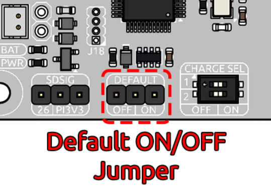

.. raw:: html

    

此跳线用于选择关机后 USB 电源输出是否默认启用。使用跳线帽连接标记为 ON 或 OFF 的引脚进行选择。

* 如果跳线帽位于左侧并连接到 OFF，关机后插入 USB 电源不会激活输出。
* 如果跳线帽位于右侧并连接到 ON，关机后插入 USB 电源将激活输出。

此功能通常用于需要自动启动的设备，如个人服务器。例如，如果发生停电，PiPower 5 将接管 Raspberry Pi 的电源，确保安全关机。一旦电源恢复，PiPower 5 自动为 Raspberry Pi 通电，无需手动干预。

.. _pin_header:

RPi 排针
---------------------------

排针设计用于直接连接到 Raspberry Pi，包括 I2C 通信和电源供应。

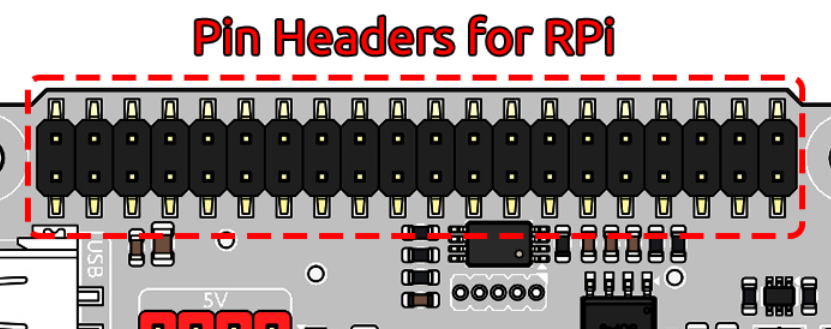

.. raw:: html

    

排针支持堆叠额外的 HAT。但是，请注意 I2C 引脚和引脚 26 已连接，可能需要小心管理以避免冲突。

.. list-table::
   :widths: 15 15
   :header-rows: 1

   * - Raspberry Pi
     - 板载 MCU
   * - SDA
     - SDA
   * - SCL
     - SCL
   * - GPIO26
     - SHUTDOWN
   * - ID_SD
     - ID_EEPROM SDA
   * - ID_SC
     - ID_EEPROM SCL

I2C 通信
-------------------------------

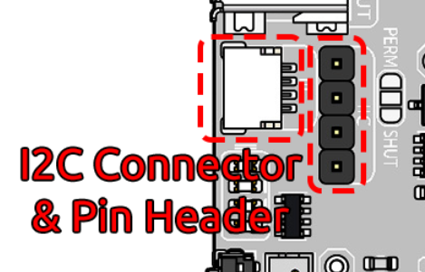

.. raw:: html

    

I2C 地址：0x5C

板载微控制器收集板上的各种信号并将其存储在寄存器中。这些信号可以通过 I2C 使用以下寄存器表访问。

.. raw:: html

   

   <table class="custom-register-table">
       <caption>寄存器表</caption>
       <thead>
           <tr>
               <th>名称</th>
               <th>地址</th>
               <th>数据长度</th>
               <th>数据类型</th>
               <th>单位</th>
               <th>描述</th>
           </tr>
       </thead>
       <tbody>
           <tr>
               <td>输入电压</td>
               <td>0</td>
               <td>2</td>
               <td>u16</td>
               <td>mV</td>
               <td>-</td>
           </tr>
           <tr>
               <td>输入电流</td>
               <td>2</td>
               <td>2</td>
               <td>u16</td>
               <td>mA</td>
               <td>-</td>
           </tr>
           <tr>
               <td>输出电压</td>
               <td>4</td>
               <td>2</td>
               <td>u16</td>
               <td>mV</td>
               <td>-</td>
           </tr>
           <tr>
               <td>输出电流</td>
               <td>6</td>
               <td>2</td>
               <td>u16</td>
               <td>mA</td>
               <td>-</td>
           </tr>
           <tr>
               <td>电池电压</td>
               <td>8</td>
               <td>2</td>
               <td>u16</td>
               <td>mV</td>
               <td>-</td>
           </tr>
           <tr>
               <td>电池电流</td>
               <td>10</td>
               <td>2</td>
               <td>i16</td>
               <td>mA</td>
               <td>-</td>
           </tr>
           <tr>
               <td>电池百分比</td>
               <td>12</td>
               <td>1</td>
               <td>u8</td>
               <td>%</td>
               <td>-</td>
           </tr>
           <tr>
               <td>电池容量</td>
               <td>13</td>
               <td>2</td>
               <td>u16</td>
               <td>mAh</td>
               <td>-</td>
           </tr>
           <tr>
               <td>电源</td>
               <td>15</td>
               <td>1</td>
               <td>u8</td>
               <td>-</td>
               <td>0：电池未供电。  1：电池供电。</td>
           </tr>
           <tr>
               <td>USB 连接状态</td>
               <td>16</td>
               <td>1</td>
               <td>u8</td>
               <td>-</td>
               <td>0：USB 未插入。  1：USB 已插入。</td>
           </tr>
           <tr>
               <td>保留</td>
               <td>17</td>
               <td>1</td>
               <td>-</td>
               <td>-</td>
               <td>-</td>
           </tr>
           <tr>
               <td>充电状态</td>
               <td>18</td>
               <td>1</td>
               <td>u8</td>
               <td>-</td>
               <td>0：未充电。  1：充电中。</td>
           </tr>
           <tr>
               <td>风扇功率</td>
               <td>19</td>
               <td>1</td>
               <td>u8</td>
               <td>-</td>
               <td>风扇功率级别（0–100）。</td>
           </tr>
           <tr>
               <td>关机请求</td>
               <td>20</td>
               <td>1</td>
               <td>u8</td>
               <td>-</td>
               <td>1：低电量触发。 2：按下电源按钮触发。</td>
           </tr>
           <tr>
               <td>固件版本（主）</td>
               <td>128</td>
               <td>1</td>
               <td>u8</td>
               <td>-</td>
               <td>-</td>
           </tr>
           <tr>
               <td>固件版本（次）</td>
               <td>129</td>
               <td>1</td>
               <td>u8</td>
               <td>-</td>
               <td>-</td>
           </tr>
           <tr>
               <td>固件版本（补丁）</td>
               <td>130</td>
               <td>1</td>
               <td>u8</td>
               <td>-</td>
               <td>-</td>
           </tr>
           <tr>
               <td>复位代码</td>
               <td>131</td>
               <td>1</td>
               <td>u8</td>
               <td>-</td>
               <td>MCU 复位原因代码。</td>
           </tr>
           <tr>
               <td>RTC 年</td>
               <td>132</td>
               <td>1</td>
               <td>u8</td>
               <td>-</td>
               <td>-</td>
           </tr>
           <tr>
               <td>RTC 月</td>
               <td>133</td>
               <td>1</td>
               <td>u8</td>
               <td>-</td>
               <td>-</td>
           </tr>
           <tr>
               <td>RTC 日</td>
               <td>134</td>
               <td>1</td>
               <td>u8</td>
               <td>-</td>
               <td>-</td>
           </tr>
           <tr>
               <td>RTC 时</td>
               <td>135</td>
               <td>1</td>
               <td>u8</td>
               <td>-</td>
               <td>-</td>
           </tr>
           <tr>
               <td>RTC 分</td>
               <td>136</td>
               <td>1</td>
               <td>u8</td>
               <td>-</td>
               <td>-</td>
           </tr>
           <tr>
               <td>RTC 秒</td>
               <td>137</td>
               <td>1</td>
               <td>u8</td>
               <td>-</td>
               <td>-</td>
           </tr>
           <tr>
               <td>RTC 亚秒</td>
               <td>138</td>
               <td>1</td>
               <td>u8</td>
               <td>1/128 s</td>
               <td>RTC 亚秒（1/128 秒）。</td>
           </tr>
           <tr>
               <td>常开功能</td>
               <td>139</td>
               <td>1</td>
               <td>u8</td>
               <td>-</td>
               <td>0：启用。  1：禁用。</td>
           </tr>
           <tr>
               <td>板 ID</td>
               <td>140</td>
               <td>1</td>
               <td>u8</td>
               <td>-</td>
               <td>板识别：  0：Pironman U1。  1：Pironman 4。  2：PiPower 3。 4：PiPower 5。</td>
           </tr>
           <tr>
               <td>保留</td>
               <td>141</td>
               <td>1</td>
               <td>-</td>
               <td>-</td>
               <td>-</td>
           </tr>
           <tr>
               <td>保留</td>
               <td>142</td>
               <td>1</td>
               <td>-</td>
               <td>-</td>
               <td>-</td>
           </tr>
           <tr>
               <td>关机百分比</td>
               <td>143</td>
               <td>1</td>
               <td>u8</td>
               <td>-</td>
               <td>当前低电量关机百分比阈值。</td>
           </tr>
           <tr>
               <td>保留</td>
               <td>144</td>
               <td>1</td>
               <td>-</td>
               <td>-</td>
               <td>-</td>
           </tr>
       </tbody>
   </table>

   <table class="custom-register-table">
       <caption>寄存器设置表</caption>
       <thead>
           <tr>
               <th>名称</th>
               <th>地址</th>
               <th>数据长度</th>
               <th>数据类型</th>
               <th>单位</th>
               <th>描述</th>
           </tr>
       </thead>
       <tbody>
           <tr>
               <td>风扇功率</td>
               <td>0</td>
               <td>1</td>
               <td>u8</td>
               <td>-</td>
               <td>设置风扇速度（0–100）。</td>
           </tr>
           <tr>
               <td>RTC 年</td>
               <td>1</td>
               <td>1</td>
               <td>u8</td>
               <td>-</td>
               <td>设置 RTC 年。</td>
           </tr>
           <tr>
               <td>RTC 月</td>
               <td>2</td>
               <td>1</td>
               <td>u8</td>
               <td>-</td>
               <td>设置 RTC 月。</td>
           </tr>
           <tr>
               <td>RTC 日</td>
               <td>3</td>
               <td>1</td>
               <td>u8</td>
               <td>-</td>
               <td>设置 RTC 日。</td>
           </tr>
           <tr>
               <td>RTC 时</td>
               <td>4</td>
               <td>1</td>
               <td>u8</td>
               <td>-</td>
               <td>设置 RTC 时。</td>
           </tr>
           <tr>
               <td>RTC 分</td>
               <td>5</td>
               <td>1</td>
               <td>u8</td>
               <td>-</td>
               <td>设置 RTC 分。</td>
           </tr>
           <tr>
               <td>RTC 秒</td>
               <td>6</td>
               <td>1</td>
               <td>u8</td>
               <td>-</td>
               <td>设置 RTC 秒。</td>
           </tr>
           <tr>
               <td>RTC 亚秒</td>
               <td>7</td>
               <td>1</td>
               <td>u8</td>
               <td>1/128 s</td>
               <td>设置 RTC 亚秒。</td>
           </tr>
           <tr>
               <td>RTC 设置</td>
               <td>8</td>
               <td>1</td>
               <td>u8</td>
               <td>-</td>
               <td>启用 RTC 设置：  1：启用。</td>
           </tr>
           <tr>
               <td>关机百分比</td>
               <td>9</td>
               <td>1</td>
               <td>u8</td>
               <td>-</td>
               <td>设置低电量关机百分比阈值（0–100）。</td>
           </tr>
           <tr>
               <td>断电百分比</td>
               <td>10</td>
               <td>1</td>
               <td>u8</td>
               <td>-</td>
               <td>设置低电量断电百分比阈值（0–100）。</td>
           </tr>
       </tbody>
   </table>

