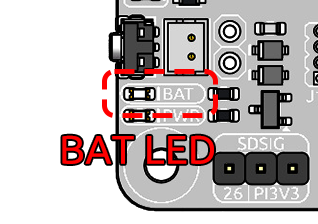
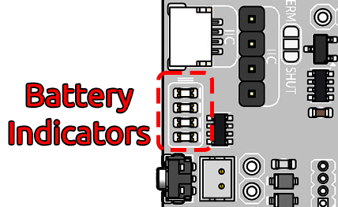

PiPower 5 HAT
======================

Overview
-------------------

.. image:: img/pipower5_pinout.png
  :width: 100%

1. **USB Type-C Power Input**: External power input for supplying power to the Raspberry Pi and charging the battery. Supports USB PD protocol, 5V–15V.
2. **DC Power Input**: DC Power Jack, 5.5mm Outer Diameter, 2.1mm Inner Diameter. External power input for powering the Raspberry Pi and charging the battery. Supports 5V–15V.
3. **Power Input Selector Switch**: Toggles between available power input sources. Details at: :ref:`power_input`
4. :ref:`cap_onoff`: Determines whether the device powers on automatically when external power is connected while the device is off.
5. :ref:`cap_sdsig` **(Shutdown Signal)**: GPIO26 short-circuit connection for Raspberry Pi shutdown signaling. After configuring the Raspberry Pi's shutdown signal, it informs the onboard microcontroller to cut off power during shutdown.
6. :ref:`cap_btn` **(External Power Button Jumper)**: Connects to an external power button. When connected to a momentary button, it functions identically to the onboard button.
7. **PWR LED**: Indicates output status. Lights up when the output is active.
8. **BAT LED**: Indicates battery power supply status. Lights up when the device is powered by the battery, signaling battery consumption.
9. :ref:`power_button`:
    
   - Single press: Activates output.
   - Long press (2 seconds) and release: Sends a shutdown request via I²C.
   - Long press (5 seconds): Directly turns off the output.
10. :ref:`battery_indicators` **LED**: Displays battery level and charging status. During charging, the indicator remains lit even in the off state until fully charged.
11. **I²C Interface (SH1.0 4-pin Connector)**: Compatible with Qwiic and STEMMA QT.
12. **I²C Interface (1×4 2.54mm Header)**: Standard 4-pin header for I²C communication.
13. **USB Type-A Output**: Provides 5V output.
14. **Power Output Interface**: 2×4 2.54mm header for 5V output.
15. :ref:`pin_header`: Connects directly to the Raspberry Pi, linking I²C, power, and other pins. Refer to the Raspberry Pi pinout diagram. Note: The I²C interface and GPIO26 pin are pre-connected and must be considered when stacking HATs.
16. **Battery Reverse Polarity Warning LED**: Two red LEDs light up to warn of reversed battery connection.
17. :ref:`battery_connector`: XH2.54 3-pin connector. From left to right: negative terminal, mid-point between two batteries, positive terminal.

Specification Table
-----------------------------

.. list-table:: 
   :header-rows: 1
   :widths: 20 20 20 20 20

   * - Parameter
     - Minimum
     - Typical
     - Maximum
     - Unit
   * - Battery Shutdown Current
     - \-
     - 60
     - \-
     - µA
   * - Battery Quiescent Current
     - \-
     - 25
     - \-
     - mA
   * - DC-DC Output Voltage
     - 5.1957
     - 5.2855
     - 5.3766
     - V
   * - DC-DC Over-Temperature Protection
     - \-
     - 150
     - \-
     - ℃
   * - Battery Charging Power
     - \-
     - \-
     - 20
     - W
   * - Charging Over-Temperature Protection
     - \-
     - 125
     - \-
     - ℃
   * - Balancing Resistor
     - \-
     - 60
     - \-
     - Ω
   * - Balancing Activation Voltage
     - \-
     - 4.2
     - \-
     - V

.. _power_input:

Power Input
-------------

.. raw:: html

    

When using Raspberry Pi 5, it is recommended to use a USB PD power supply or a DC power supply with a minimum output of 32W. Otherwise, during periods of high power consumption, the battery may fail to charge properly or even deplete its charge due to insufficient power supply.

You can monitor the **BAT LED** indicator to check the battery status. When external power is sufficient, the BAT LED should remain off, indicating that the battery is in standby mode and not being discharged. If the BAT LED lights up, it means the battery is supplying power to the device, possibly due to insufficient or disconnected external power. Prolonged illumination of the BAT LED may lead to excessive battery discharge, preventing it from functioning as an uninterrupted power supply (UPS) during power outages. Ensure you are using a power source that meets the required specifications to avoid such scenarios.

.. raw:: html

    

**Power Path**

The PiPower 5 integrates power path management, enabling automatic power source switching to minimize battery wear and ensure uninterrupted power supply. The key functionalities include:

- When an external power source is connected, the 5V output is supplied via a step-down circuit from the external source. The output can be turned off using a switch. If conditions allow, the external power source can also charge the battery simultaneously (see the "Charging Current" section for details).
- Upon disconnection of the external power source, the system immediately switches to battery power via a step-down circuit. This seamless transition ensures the system continues functioning normally during power interruptions.

You can check the BAT LED indicator to confirm whether the battery is currently powering the system.

**Charging Current**

The charging current is subject to two types of limitations:

.. note::

   The charging current is determined by both the "DC Power Charging Limitation" and the "Input Power Selection Limitation" and is constrained by the smaller value between the two.

1. DC Power Charging Limitation
   
   When supplying power via the DC 5.5-2.1 interface, the charging current is automatically adjusted based on the input voltage, as shown below:

   .. list-table::
      :header-rows: 1

      * - Input Voltage (VBUS)
        - Maximum Charging Current
      * - 4.5 < VBUS ≤ 6.5V
        - 3A
      * - 6.5 < VBUS ≤ 9.5V
        - 2A
      * - 9.5 < VBUS ≤ 13.5V
        - 1.5A
      * - 13.5 < VBUS ≤ 16.5V
        - 2A

2. Input Power Selection Limitation
   
   A 2-position DIP switch on the board allows selection of different input power levels. The corresponding allocation of charging power and output power for each setting is as follows:

   .. image:: img/power_selector.png
     :width: 90%
     :align: center

   .. list-table::
      :header-rows: 1

      * - PS1
        - PS2
        - Power Level
        - Charging Power
        - Output Power
      * - 0
        - 0
        - ≤ 32W
        - 5W
        - ≤ 3A
      * - 0
        - 1
        - ≥ 32W
        - 5W
        - 5A
      * - 1
        - 0
        - ≥ 37W
        - 10W
        - 5A
      * - 1
        - 1
        - ≥ 45W
        - 20W
        - 5A

**Charging Process**

- When the battery voltage ``VBAT <= 2.5V``, the system performs trickle charging at a low current, approximately 50 mA.
- When ``2.5V < VBAT <= VTRKL``, trickle charging continues, and the battery charging current increases to approximately 200 mA.
- When ``VTRKL < VBAT < VCV``, the system switches to constant current charging, supplying a preset constant current to the battery.
- Once ``VBAT = VCV``, and the battery voltage approaches the fully charged level, the charging current gradually decreases, transitioning to constant voltage charging.
- During constant voltage charging, when the charging current drops below ``ISTOP`` and the battery voltage is near the constant voltage threshold, charging stops, and the battery enters a fully charged state.- In the fully charged state, the system continuously monitors the battery voltage. If the voltage falls below ``VRCH``, charging resumes automatically.

**Protection Features**

The PiPower 5 offers comprehensive protection features, including input undervoltage and overvoltage protection, as well as overheating protection for both the charging chip and DC-DC converter. These features ensure stable and reliable system operation.

**Charge Balancing**

The onboard charge-balancing chip activates a 60Ω resistor to discharge the battery at a low current when it detects that a single cell's voltage exceeds 4.2V. This feature helps maintain voltage balance across cells.

**Temperature Protection**

The charging process is automatically halted when the internal temperature of the charging chip exceeds 125°C. Similarly, the DC-DC chip disables output when its internal temperature surpasses 150°C.

.. _power_button:

Power Button
----------------

.. raw:: html

    

Onboard power button for controlling the board's power:

* **Single press**: Activates output.
* **Hold for 2 seconds until the middle two battery LEDs light up, then release**: Sends a shutdown request via I2C.
* **Hold for more than 5 seconds**: Directly turns off output.
  

.. _battery_indicators:

Battery Indicators
--------------------------------

Four onboard LEDs indicate the battery level and charging status.

.. note::

   If the device is charging during shutdown, the indicator light will continue to display the charging status until charging is complete.

.. raw:: html

    

* **4 LEDs lit**: Battery >80%
* **3 LEDs lit**: 60%< Battery <80%
* **2 LEDs lit**: 40%< Battery <60%
* **1 LED lit**: 20%< Battery <40%
* **First LED flashing**: Battery <20%
* **LEDs light up sequentially in a cycle**: Charging in progress
* **Middle two LEDs flashing**: Waiting shutdown signal
* **All LEDs off**: Unpowered or in sleep mode

.. _battery_connector:

Battery Connector
------------------------
XH2.54 3P battery connector.

.. raw:: html

    

.. _cap_btn:

BTN Jumper
-------------

.. raw:: html

    

BTN jumper is designed for connecting an external power button. If you install PiPower 5 in an enclosure, the onboard power button might be inaccessible. In such cases, you can connect an external button to control the power.

To set it up, connect a momentary switch, such as a tactile switch or a vintage-style metal button, to the jumper pins. The two leads of the button can be connected to the jumper's pins in any direction, as polarity is not required. Once connected, you can use the external button just like the onboard power button.

.. _cap_sdsig:

SDSIG Jumper
------------

.. raw:: html

    

The Shutdown Signal (SDSIG) pin controls the power-off state of the host system. Pulling this pin high indicates that the host has shut down and needs to be powered off. Pulling the pin low signals that the host is powered on.

For systems where this functionality is not required (e.g., microcontroller-based platforms such as Arduino or Raspberry Pi Pico), connect this jumper to the GND pin.

For Raspberry Pi users, connect the jumper to pin 26 on the GPIO header. After installing the PiPower 5 software, the Raspberry Pi will pull this pin high upon shutdown, prompting PiPower 5 to cut power to the system.

.. _cap_onoff:

Default ON/OFF Jumper
----------------------

.. raw:: html

    

This jumper is used to select whether the USB power output is enabled by default after a shutdown. Use the jumper cap to connect the pins labeled ON or OFF to make the selection.

* If the jumper cap is positioned on the left and connected to OFF, inserting USB power after a shutdown will not activate the output.
* If the jumper cap is positioned on the right and connected to ON, inserting USB power after a shutdown will activate the output.

This feature is typically used for devices that need to start automatically, such as personal servers. For example, if there is a power outage, PiPower 5 will take over the Raspberry Pi's power supply, ensuring a safe shutdown. Once power is restored, PiPower 5 automatically powers on the Raspberry Pi, eliminating the need for manual intervention.

.. _pin_header:

Pin Headers for RPi
---------------------------

The pin header is designed for direct connection to a Raspberry Pi, including both I2C communication and power supply. 

.. raw:: html

    

The header supports stacking additional HATs. However, note that the I2C pins and pin 26 are already connected and may need to be managed carefully to avoid conflicts.

.. list-table:: 
   :widths: 15 15
   :header-rows: 1

   * - Raspberry Pi
     - MCU On Board
   * - SDA
     - SDA
   * - SCL
     - SCL
   * - GPIO26
     - SHUTDOWN
   * - ID_SD
     - ID_EEPROM SDA
   * - ID_SC
     - ID_EEPROM SCL

I2C Communication
-------------------------------

.. raw:: html

    

I2C address: 0x5a

The onboard microcontroller collects various signals from the board and stores them in registers. These signals can be accessed via I2C using the following register tables.

.. raw:: html

   

   <table class="custom-register-table">
       <caption>Register Table</caption>
       <thead>
           <tr>
               <th>Name</th>
               <th>Address</th>
               <th>Data Length</th>
               <th>Data Type</th>
               <th>Unit</th>
               <th>Description</th>
           </tr>
       </thead>
       <tbody>
           <tr>
               <td>Input Voltage</td>
               <td>0</td>
               <td>2</td>
               <td>u16</td>
               <td>mV</td>
               <td>-</td>
           </tr>
           <tr>
               <td>Input Current</td>
               <td>2</td>
               <td>2</td>
               <td>u16</td>
               <td>mA</td>
               <td>-</td>
           </tr>
           <tr>
               <td>Output Voltage</td>
               <td>4</td>
               <td>2</td>
               <td>u16</td>
               <td>mV</td>
               <td>-</td>
           </tr>
           <tr>
               <td>Output Current</td>
               <td>6</td>
               <td>2</td>
               <td>u16</td>
               <td>mA</td>
               <td>-</td>
           </tr>
           <tr>
               <td>Battery Voltage</td>
               <td>8</td>
               <td>2</td>
               <td>u16</td>
               <td>mV</td>
               <td>-</td>
           </tr>
           <tr>
               <td>Battery Current</td>
               <td>10</td>
               <td>2</td>
               <td>i16</td>
               <td>mA</td>
               <td>-</td>
           </tr>
           <tr>
               <td>Battery Percentage</td>
               <td>12</td>
               <td>1</td>
               <td>u8</td>
               <td>%</td>
               <td>-</td>
           </tr>
           <tr>
               <td>Battery Capacity</td>
               <td>13</td>
               <td>2</td>
               <td>u16</td>
               <td>mAh</td>
               <td>-</td>
           </tr>
           <tr>
               <td>Power Source</td>
               <td>15</td>
               <td>1</td>
               <td>u8</td>
               <td>-</td>
               <td>0: Battery not supplying power.  1: Battery supplying power.</td>
           </tr>
           <tr>
               <td>USB Connection Status</td>
               <td>16</td>
               <td>1</td>
               <td>u8</td>
               <td>-</td>
               <td>0: USB unplugged.  1: USB plugged in.</td>
           </tr>
           <tr>
               <td>RESERVED</td>
               <td>17</td>
               <td>1</td>
               <td>-</td>
               <td>-</td>
               <td>-</td>
           </tr>
           <tr>
               <td>Charging Status</td>
               <td>18</td>
               <td>1</td>
               <td>u8</td>
               <td>-</td>
               <td>0: Not charging.  1: Charging.</td>
           </tr>
           <tr>
               <td>Fan Power</td>
               <td>19</td>
               <td>1</td>
               <td>u8</td>
               <td>-</td>
               <td>Fan power level (0–100).</td>
           </tr>
           <tr>
               <td>Shutdown Request</td>
               <td>20</td>
               <td>1</td>
               <td>u8</td>
               <td>-</td>
               <td>1: Triggered by low battery. 2: Triggered by pressing the power button.</td>
           </tr>
           <tr>
               <td>Firmware Version (Major)</td>
               <td>128</td>
               <td>1</td>
               <td>u8</td>
               <td>-</td>
               <td>-</td>
           </tr>
           <tr>
               <td>Firmware Version (Minor)</td>
               <td>129</td>
               <td>1</td>
               <td>u8</td>
               <td>-</td>
               <td>-</td>
           </tr>
           <tr>
               <td>Firmware Version (Patch)</td>
               <td>130</td>
               <td>1</td>
               <td>u8</td>
               <td>-</td>
               <td>-</td>
           </tr>
           <tr>
               <td>Reset Code</td>
               <td>131</td>
               <td>1</td>
               <td>u8</td>
               <td>-</td>
               <td>MCU reset reason code.</td>
           </tr>
           <tr>
               <td>RTC Year</td>
               <td>132</td>
               <td>1</td>
               <td>u8</td>
               <td>-</td>
               <td>-</td>
           </tr>
           <tr>
               <td>RTC Month</td>
               <td>133</td>
               <td>1</td>
               <td>u8</td>
               <td>-</td>
               <td>-</td>
           </tr>
           <tr>
               <td>RTC Day</td>
               <td>134</td>
               <td>1</td>
               <td>u8</td>
               <td>-</td>
               <td>-</td>
           </tr>
           <tr>
               <td>RTC Hour</td>
               <td>135</td>
               <td>1</td>
               <td>u8</td>
               <td>-</td>
               <td>-</td>
           </tr>
           <tr>
               <td>RTC Minute</td>
               <td>136</td>
               <td>1</td>
               <td>u8</td>
               <td>-</td>
               <td>-</td>
           </tr>
           <tr>
               <td>RTC Second</td>
               <td>137</td>
               <td>1</td>
               <td>u8</td>
               <td>-</td>
               <td>-</td>
           </tr>
           <tr>
               <td>RTC Sub-Second</td>
               <td>138</td>
               <td>1</td>
               <td>u8</td>
               <td>1/128 s</td>
               <td>RTC sub-second (1/128 second).</td>
           </tr>
           <tr>
               <td>Always-On Feature</td>
               <td>139</td>
               <td>1</td>
               <td>u8</td>
               <td>-</td>
               <td>0: Enabled.  1: Disabled.</td>
           </tr>
           <tr>
               <td>Board ID</td>
               <td>140</td>
               <td>1</td>
               <td>u8</td>
               <td>-</td>
               <td>Board identification:   0: Pironman U1.  1: Pironman 4.  2: PiPower 3. 4: PiPower 5.</td>
           </tr>
           <tr>
               <td>RESERVED</td>
               <td>141</td>
               <td>1</td>
               <td>-</td>
               <td>-</td>
               <td>-</td>
           </tr>
           <tr>
               <td>RESERVED</td>
               <td>142</td>
               <td>1</td>
               <td>-</td>
               <td>-</td>
               <td>-</td>
           </tr>
           <tr>
               <td>Shutdown Percentage</td>
               <td>143</td>
               <td>1</td>
               <td>u8</td>
               <td>-</td>
               <td>Current low battery shutdown percentage threshold.</td>
           </tr>
           <tr>
               <td>RESERVED</td>
               <td>144</td>
               <td>1</td>
               <td>-</td>
               <td>-</td>
               <td>-</td>
           </tr>
       </tbody>
   </table>

   <table class="custom-register-table">
       <caption>Register Settings Table</caption>
       <thead>
           <tr>
               <th>Name</th>
               <th>Address</th>
               <th>Data Length</th>
               <th>Data Type</th>
               <th>Unit</th>
               <th>Description</th>
           </tr>
       </thead>
       <tbody>
           <tr>
               <td>Fan Power</td>
               <td>0</td>
               <td>1</td>
               <td>u8</td>
               <td>-</td>
               <td>Set fan speed (0–100).</td>
           </tr>
           <tr>
               <td>RTC Year</td>
               <td>1</td>
               <td>1</td>
               <td>u8</td>
               <td>-</td>
               <td>Set RTC year.</td>
           </tr>
           <tr>
               <td>RTC Month</td>
               <td>2</td>
               <td>1</td>
               <td>u8</td>
               <td>-</td>
               <td>Set RTC month.</td>
           </tr>
           <tr>
               <td>RTC Day</td>
               <td>3</td>
               <td>1</td>
               <td>u8</td>
               <td>-</td>
               <td>Set RTC day.</td>
           </tr>
           <tr>
               <td>RTC Hour</td>
               <td>4</td>
               <td>1</td>
               <td>u8</td>
               <td>-</td>
               <td>Set RTC hour.</td>
           </tr>
           <tr>
               <td>RTC Minute</td>
               <td>5</td>
               <td>1</td>
               <td>u8</td>
               <td>-</td>
               <td>Set RTC minute.</td>
           </tr>
           <tr>
               <td>RTC Second</td>
               <td>6</td>
               <td>1</td>
               <td>u8</td>
               <td>-</td>
               <td>Set RTC second.</td>
           </tr>
           <tr>
               <td>RTC Sub-Second</td>
               <td>7</td>
               <td>1</td>
               <td>u8</td>
               <td>1/128 s</td>
               <td>Set RTC sub-second.</td>
           </tr>
           <tr>
               <td>RTC Setting</td>
               <td>8</td>
               <td>1</td>
               <td>u8</td>
               <td>-</td>
               <td>Enable RTC setting:   1: Enabled.</td>
           </tr>
           <tr>
               <td>Shutdown Percentage</td>
               <td>9</td>
               <td>1</td>
               <td>u8</td>
               <td>-</td>
               <td>Set low battery shutdown percentage threshold (0–100).</td>
           </tr>
           <tr>
               <td>Power Off Percentage</td>
               <td>10</td>
               <td>1</td>
               <td>u8</td>
               <td>-</td>
               <td>Set low battery power-off percentage threshold (0–100).</td>
           </tr>
       </tbody>
   </table>

   