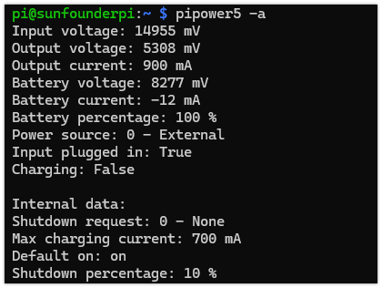
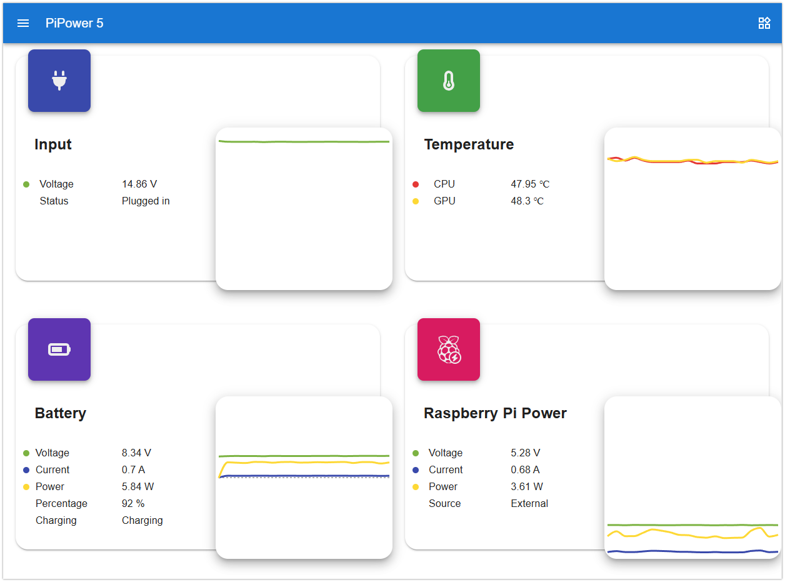
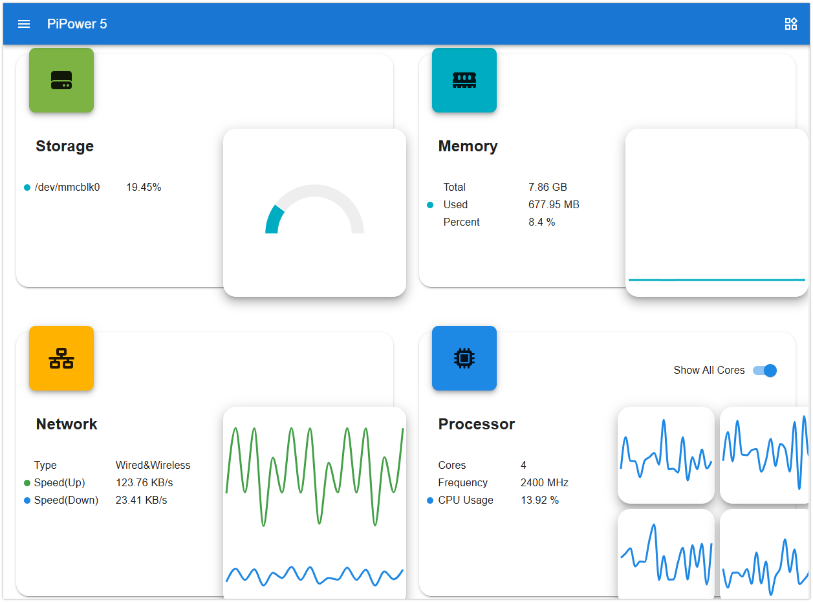
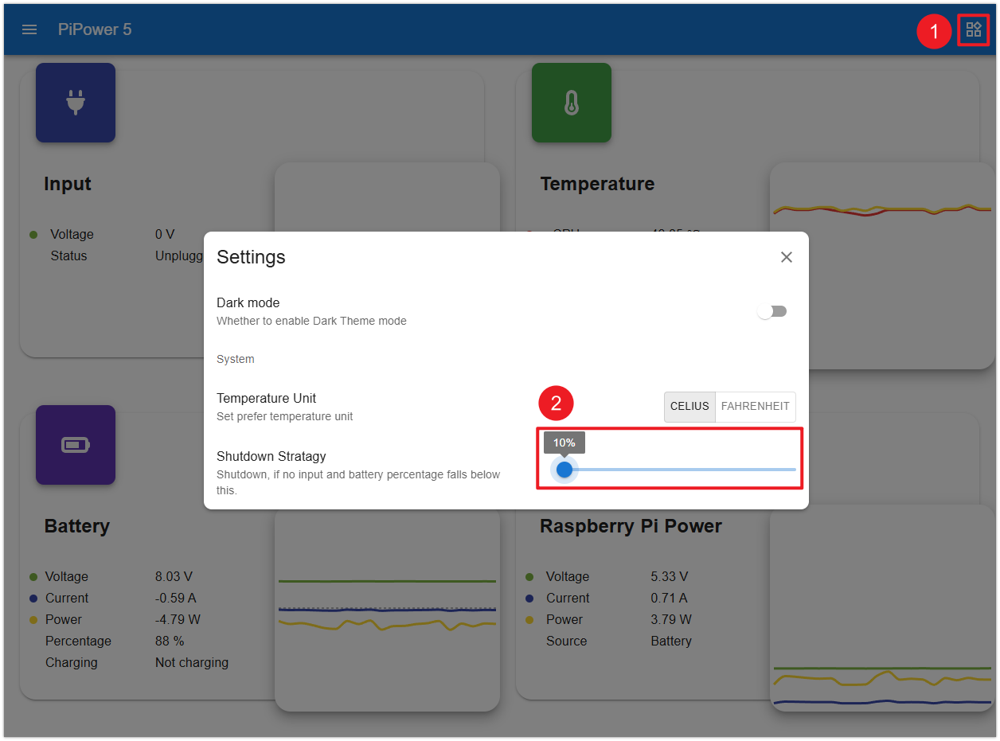

.. _pipower_5_tool:
PiPower 5 Tool
===============================

The |link_pipower_tool| is the companion software for PiPower 5. 

PiPower 5 sends a shutdown signal in the following scenarios, and the PiPower 5 Tool is responsible for processing these signals:

- The power button is held for two seconds and then released.
- The external power supply is disconnected, and the battery level reaches the configured shutdown percentage.

You can also use this tool to retrieve various information from PiPower 5, such as voltage, current, and more.

Install the PiPower 5 Tool
----------------------------------------------------

1. Download the library from GitHub:

   .. code-block:: shell
       
       git clone https://github.com/sunfounder/pipower5

2. Navigate to the directory:
   
   .. code-block:: shell
   
       cd pipower5

3. Run the installation script:

   .. code-block:: shell
   
       sudo python3 install.py

   This command also installs a :ref:`web dashboard <web_dashboard>` that runs on port 34001 of your device. The dashboard provides access to PiPower and Raspberry Pi device information. If you do not need the web dashboard, use this command instead:
   
   .. code-block:: shell
   
       sudo python install.py --disable-dashboard
   
   After installation, you will be prompted to restart the system. Enter ``Y`` and press **Enter** to reboot. Once rebooted, the PiPower 5 safe shutdown service will start automatically.
   
   .. image:: img/pi_install_pipower.png
     :width: 90%
     :align: center

After that, if the power button is pressed for 2 seconds or the battery power is low, PiPower 5 will notify the Raspberry Pi to shut down and disconnect the power.

Basic Command Usage
------------------------------------------------------

When the Raspberry Pi is not connected to an external power supply and the battery voltage drops below the configured shutdown percentage, PiPower 5 sends a "low battery" shutdown request via I²C. A Raspberry Pi with the PiPower 5 Tool installed can process this request, execute the shutdown command, raise the SDSIG pin, and allow PiPower 5 to disconnect the power, preventing unexpected data loss caused by sudden power outages.

After installing the ``pipower5`` library, the Raspberry Pi will automatically manage safe shutdowns.

Configure Shutdown Percentage
++++++++++++++++++++++++++++++++++++++

To set the shutdown percentage, use the following command:

.. code-block:: shell

    pipower5 -sp [PERCENTAGE]

Example:

Set the shutdown percentage to 30%:

.. code-block:: shell

    pipower5 -sp 30

When the battery level drops below 30%, PiPower 5 will notify the Raspberry Pi to shut down and disconnect the power.

.. tip::

   If you are using high-power peripherals (>3A), the battery may not be able to provide power for a long time, consider setting the shutdown percentage to 100%. This ensures immediate shutdown when external power is disconnected, protecting the Raspberry Pi and its data.

Retrieving Data with PiPower5
++++++++++++++++++++++++++++++++++++++++

You can use the ``pipower5`` command to view the current information. The detailed command parameters are as follows:

.. code-block:: text

   usage: pipower5 [-h] [-sp [SHUTDOWN_PERCENTAGE]] [-iv] [-ov] [-oc] [-bv] [-bc] [-bp] [-bs] [-ii] [-ichg] [-do]
                   [-sr] [-cc] [-a] [-v] [-fv]
                   [command]
   
   PiPower 5
   
   positional arguments:
     command               Command
   
   options:
     -h, --help            show this help message and exit
     -sp [SHUTDOWN_PERCENTAGE], --shutdown-percentage [SHUTDOWN_PERCENTAGE]
                           Set shutdown percentage, leave empty to read
     -iv, --input-voltage  Read input voltage
     -ov, --output-voltage
                           Read output voltage
     -oc, --output-current
                           Read output current
     -bv, --battery-voltage
                           Read battery voltage
     -bc, --battery-current
                           Read battery current
     -bp, --battery-percentage
                           Read battery percentage
     -bs, --battery-source
                           Read battery source
     -ii, --is-input-plugged_in
                           Read is input plugged in
     -ichg, --is-charging  Read is charging
     -do, --default-on     Read default on
     -sr, --shutdown-request
                           Read shutdown request
     -cc, --charging-current
                           Max charging current
     -a, --all             Show all status
     -v, --version         pipower5 library version
     -fv, --firmware       pipower5 firmware version

Example:

.. _web_dashboard:

Web Dashboard
------------------------------------------------------

When installing the PiPower command-line tool, a Web Dashboard is also included, accessible via port 34001 on your device.

If you prefer not to use the Web Dashboard, you can remove it with the following command:

.. code-block:: shell

   sudo pipower5 --remove-dashboard

The Web Dashboard allows you to view various PiPower 5 and raspberry pi data, including:

.. raw:: html

    

Additionally, you can configure the **Shutdown Percentage** through the dashboard.

Example:

Set the shutdown percentage to 10%:

.. raw:: html

    

When the battery level drops below 10%, PiPower 5 will notify the Raspberry Pi to shut down and disconnect the power.