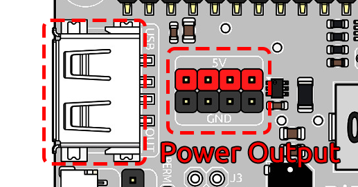
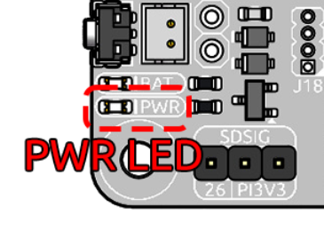

快速用户指南
===============================

本指南帮助您在硬件组装后快速开始使用 PiPower 5。

给电池充电
----------------------------------------------------

首次使用前，请将电池充满电。

建议：

- 使用高质量的 USB-C 电源适配器
- Raspberry Pi 5 推荐使用 5V 5A 电源
- 使用 SSD 或其他高功率外设时推荐使用更高功率的适配器

充电时：

- 使用高质量的 USB-C 电源为 PiPower 5 充电。

  .. image:: img/power_input.png
     :width: 50%
     :align: center

- 充电期间，电池指示灯 LED 按顺序逐步亮起。

  .. image:: img/battery_indicator.png
     :width: 50%
     :align: center

  电池状态通过亮起的 LED 数量指示：

  * **4 个 LED 亮起**：电池 >80%
  * **3 个 LED 亮起**：60%< 电池 <80%
  * **2 个 LED 亮起**：40%< 电池 <60%
  * **1 个 LED 亮起**：20%< 电池 <40%
  * **第一个 LED 闪烁**：电池 <20%
  * **LED 循环递增亮起**：正在充电
  * **中间两个 LED 闪烁**：等待关机信号
  * **所有 LED 熄灭**：未通电或处于休眠模式
  * 充电期间，指示灯**即使在关机状态下**也保持亮起，直到充满电。

开机
----------------------------------------------------

对于 Raspberry Pi 设备，无需额外的电源接线。PiPower 5 通过 GPIO 排针直接供电。

对于其他设备，您可以通过以下方式供电：

- USB-A 输出端口
- USB-A 端口旁的 5V/GND 引脚

按一次电源按钮以开启 PiPower 5。开机时：

- **PWR LED** 亮起
- 连接的设备开始从 PiPower 5 接收电源

.. include:: /pipower5_software.rst
    :start-after: start_install_pipower5
    :end-before: end_install_pipower5

打开 Web 仪表板
----------------------------------------------------

安装完成后，在浏览器中打开仪表板：

.. code-block:: text

   http://<raspberry-pi-ip>:34001

仪表板允许您：

- 查看电池百分比
- 监控充电状态
- 检查电压和电流
- 配置关机百分比
- 管理通知

.. image:: img/web_dashboard.png
   :width: 100%
   :align: center

安全关机
----------------------------------------------------

.. include:: /pipower5_software.rst
    :start-after: start_power_off_after_shutdown
    :end-before: end_power_off_after_shutdown

.. note::

   有关高级功能和详细配置选项，包括：

   - 电源监控命令
   - 通知设置
   - 蜂鸣器警报
   - 邮件警报
   - 高级配置

   请参阅：

   * :ref:`pipower5_tool`
