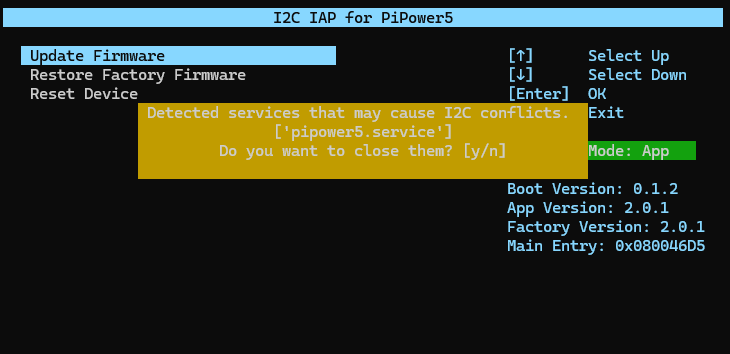
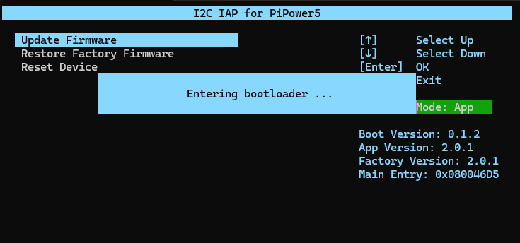
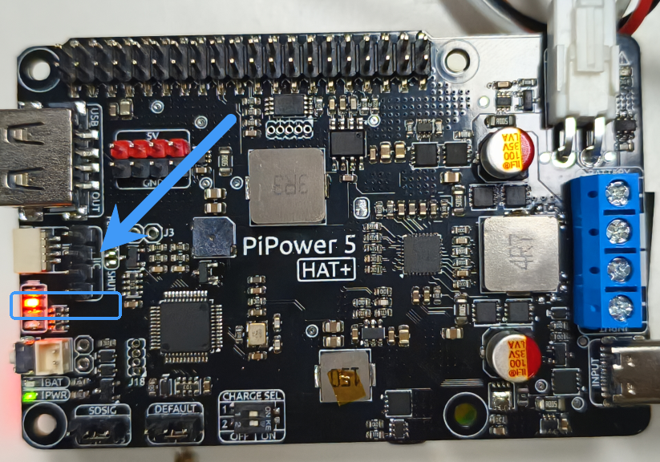
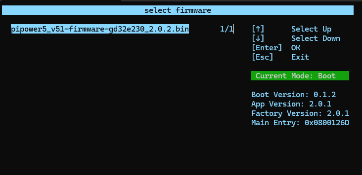
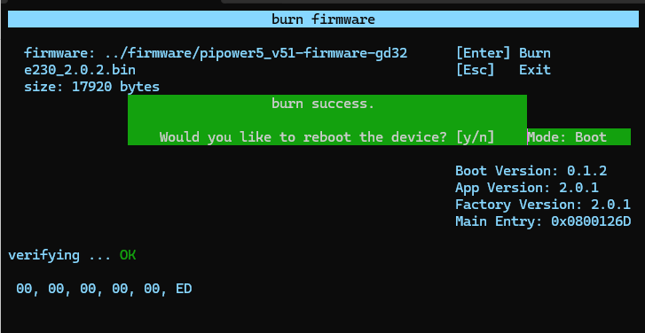
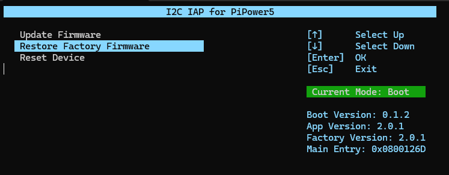
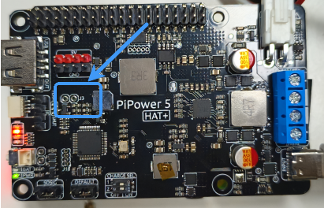
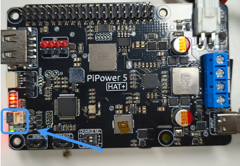

Update PiPower5 Firmware Using Raspberry Pi
===================================================================

This guide explains how to update the firmware of **PiPower5** on a Raspberry Pi.  

**1. Download** ``pipower5_update_tools`` **and install dependencies**

.. code-block:: shell

   git clone https://github.com/sunfounder/pipower5_update.git --depth 1

   sudo pip3 install blessed --break
   sudo pip3 install smbus2 --break

**2. Check for updates**

.. code-block:: shell

   cd pipower5_update_tools
   git pull

**3. Run the update tool**

.. code-block:: shell

   python3 run.py

**4. Stop the service if prompted**

When running ``pipower5_update_tools``, you may be prompted to stop ``pipower5.service``.  Press ``Y`` to stop the service.  

**5. Select** ``Update Firmware``

Choose **Update Firmware**. The Raspberry Pi will send a command that switches PiPower5 into **BOOT mode**.  

**6. Verify BOOT mode**

Once successfully in BOOT mode, the **two middle LEDs** on the PiPower5 will flash alternately, indicating BOOT mode is active.  

**7. Choose the firmware file**

Select a firmware file in ``.bin`` format and press ``Enter`` to start writing.  

**8. Complete the update**

After flashing is complete, select **Restart**.  
PiPower5 will reboot and start running the new firmware.  

----------------------------------------------------------------

**Restore Factory Firmware**

If you need to roll back to the factory firmware, use the **Restore Factory Firmware** option in ``pipower5_update_tools``.  
This will reload the firmware stored in the factory partition and revert to the original version.  

----------------------------------------------------------------

**Force BOOT Mode**

If you cannot enter BOOT mode normally, you can force it:

1. Power off PiPower5.  
2. Short the **Boot 1 pin**.  
3. Power on the device.  

PiPower5 will start directly in BOOT mode.  

To exit BOOT mode, press and hold the power button for two seconds.  
PiPower5 will then reboot into normal mode.  

----------------------------------------------------------------

**Troubleshooting**

Here are some common issues you may encounter during the update process and their solutions:

- **Device not detected**  

  - Try rebooting both the Raspberry Pi and PiPower5, then re-run the update tool.  

- **Failed to enter BOOT mode**  

  - Ensure that ``pipower5.service`` is stopped before updating.  
  - If automatic BOOT mode fails, use the **Force BOOT Mode** method (shorting the Boot 1 pin).  

- **Update process stuck or flashing failed**  

  - Double-check that the firmware file is in ``.bin`` format.  
  - Re-run the update tool and try again.  
  - Use a stable power supply to prevent interruptions during flashing.  

- **Firmware update completed, but device not working properly**  

  - Restore the factory firmware using the built-in tool.  
  - If the problem persists, verify that the firmware file matches your PiPower5 version.  
