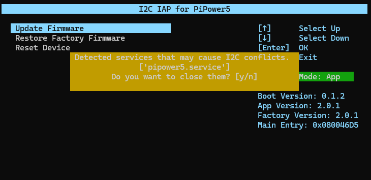
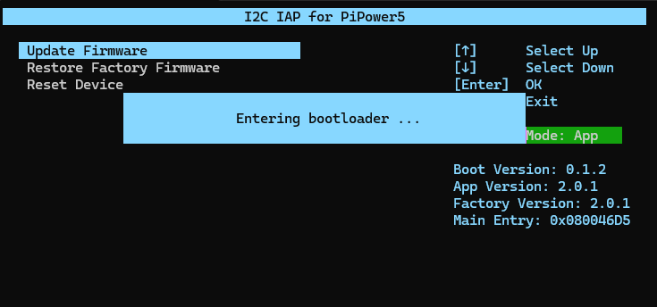
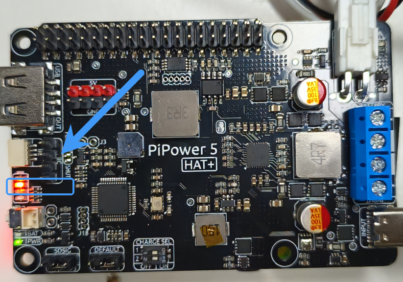
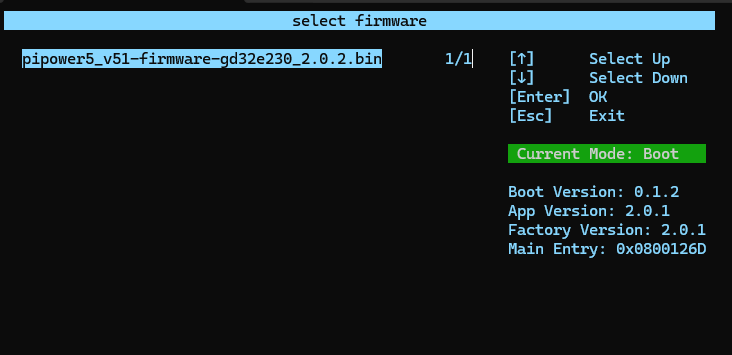
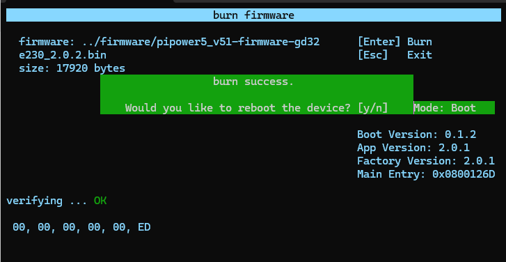
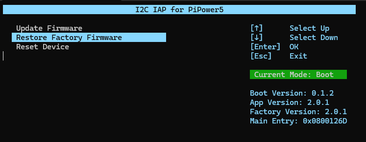
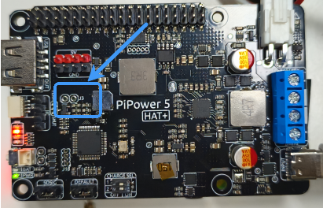
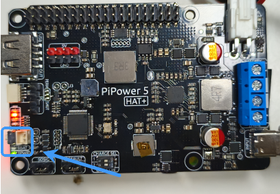

Actualizar el Firmware de PiPower5 Usando Raspberry Pi
===================================================================

Esta guía explica cómo actualizar el firmware de **PiPower5** en una Raspberry Pi.

**1. Descargar** ``pipower5_update_tools`` **e instalar dependencias**

.. code-block:: shell

   git clone https://github.com/sunfounder/pipower5_update_tools.git --depth 1

   sudo pip3 install blessed --break
   sudo pip3 install smbus2 --break

**2. Comprobar actualizaciones**

.. code-block:: shell

   cd pipower5_update_tools
   git pull

**3. Ejecutar la herramienta de actualización**

.. code-block:: shell

   python3 run.py

**4. Detener el servicio si se solicita**

Al ejecutar ``pipower5_update_tools``, se le puede pedir que detenga ``pipower5.service``. Presione ``Y`` para detener el servicio.

**5. Seleccionar** ``Update Firmware``

Elija **Update Firmware**. La Raspberry Pi enviará un comando que cambia PiPower5 al **modo BOOT**.

**6. Verificar el modo BOOT**

Una vez en modo BOOT con éxito, los **dos LEDs centrales** en el PiPower5 parpadearán alternativamente, indicando que el modo BOOT está activo.

**7. Elegir el archivo de firmware**

Seleccione un archivo de firmware en formato ``.bin`` y presione ``Enter`` para comenzar la escritura.

**8. Completar la actualización**

Después de completar el flasheo, seleccione **Restart**.
PiPower5 se reiniciará y comenzará a ejecutar el nuevo firmware.

----------------------------------------------------------------

**Restaurar Firmware de Fábrica**

Si necesita volver al firmware de fábrica, use la opción **Restore Factory Firmware** en ``pipower5_update_tools``.
Esto recargará el firmware almacenado en la partición de fábrica y volverá a la versión original.

----------------------------------------------------------------

**Forzar Modo BOOT**

Si no puede entrar en modo BOOT normalmente, puede forzarlo:

1. Apague PiPower5.
2. Cortocircuite el **pin Boot 1**.
3. Encienda el dispositivo.

PiPower5 se iniciará directamente en modo BOOT.

Para salir del modo BOOT, mantenga presionado el botón de encendido durante dos segundos.
PiPower5 se reiniciará en modo normal.

----------------------------------------------------------------

**Solución de Problemas**

Aquí hay algunos problemas comunes que puede encontrar durante el proceso de actualización y sus soluciones:

- **Dispositivo no detectado**

  - Intente reiniciar tanto la Raspberry Pi como PiPower5, luego vuelva a ejecutar la herramienta de actualización.

- **Fallo al entrar en modo BOOT**

  - Asegúrese de que ``pipower5.service`` esté detenido antes de actualizar.
  - Si el modo BOOT automático falla, use el método de **Forzar Modo BOOT** (cortocircuitando el pin Boot 1).

- **Proceso de actualización atascado o flasheo fallido**

  - Verifique que el archivo de firmware esté en formato ``.bin``.
  - Vuelva a ejecutar la herramienta de actualización e intente de nuevo.
  - Use una fuente de alimentación estable para prevenir interrupciones durante el flasheo.

- **Actualización de firmware completada, pero el dispositivo no funciona correctamente**

  - Restaure el firmware de fábrica usando la herramienta integrada.
  - Si el problema persiste, verifique que el archivo de firmware coincida con su versión de PiPower5.
